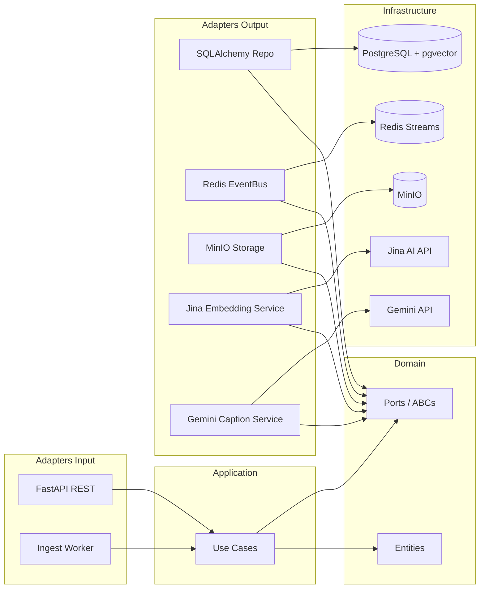
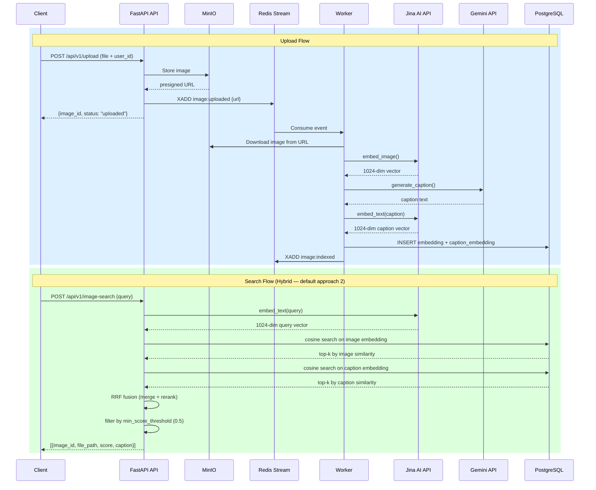

# Beekid Image Search

Text-to-image search service for the Beekid education platform. Uses Jina AI cloud embeddings stored in PostgreSQL + pgvector, with MinIO for image storage and Redis Streams for event-driven processing.

## Quick Start (Docker)

```bash
docker compose up -d
```

This starts 7 services:
- **PostgreSQL** with pgvector (port 5432)
- **Redis** (port 6379)
- **MinIO** object storage (API port 9000, console port 9001)
- **MinIO init** (creates bucket, runs once)
- **DB migrate** (runs Alembic, runs once)
- **API server** (port 8000)
- **Ingest worker** (Jina AI embeddings + Gemini captions)

Verify:

```bash
curl http://localhost:8000/health
# {"status": "ok", "checks": {"redis": "ok", "postgresql": "ok"}}
```

## Upload an Image

```bash
curl -X POST http://localhost:8000/api/v1/upload \
  -F "file=@photo.jpg" \
  -F "user_id=test-user"
# {"image_id": "uuid", "status": "uploaded"}
```

The image is stored in MinIO and an event is published to Redis. The ingest worker automatically downloads the image, generates a Jina AI embedding, and saves it to PostgreSQL.

## Search

```bash
curl -X POST http://localhost:8000/api/v1/image-search \
  -H "Content-Type: application/json" \
  -d '{"query": "a red car", "top_k": 10, "approach": 2}'
```

Results below `min_score_threshold` (default 0.5) are filtered out.

| Approach | Name | Speed | Cost |
|----------|------|-------|------|
| 1 | Pure CLIP | ~50ms | Free |
| 2 | Hybrid Caption (RRF) | ~200ms | Free |
| 3 | Multimodal RAG (Gemini) | ~500ms | ~$0.00004/query |

## API Endpoints

| Method | Path | Description |
|--------|------|-------------|
| POST | `/api/v1/upload` | Upload image, trigger auto-ingest |
| POST | `/api/v1/image-search` | Text-to-image search |
| GET | `/images/{image_id}` | Get image metadata |
| DELETE | `/images/{image_id}` | Delete image |
| GET | `/health` | Health check |

## Local Development

```bash
# Install
uv sync --extra dev

# Env vars
cp .env.example .env

# Start infra (PostgreSQL, Redis, MinIO)
docker compose up -d postgres redis minio minio-init

# Migrate
uv run alembic upgrade head

# Run API + worker
uv run uvicorn image_search.adapters.input.app:app --host 0.0.0.0 --port 8000 --reload
uv run python -m image_search.adapters.input.ingest_worker
```

## Tests

```bash
uv run pytest                     # unit tests
uv run ruff check src/ tests/     # lint
uv run ruff format src/ tests/    # format
uv run mypy src/                  # type check
```

Or use Make:

```bash
make check       # run all quality gates
make test        # unit tests only
make docker-up   # start Docker stack
make help        # see all commands
```

## Architecture

**Clean Architecture dependency flow:**



**Data flow — Upload & Search:**



## Specs

Implementation specs: `docs/specs/image-search/IS-001..IS-014`
