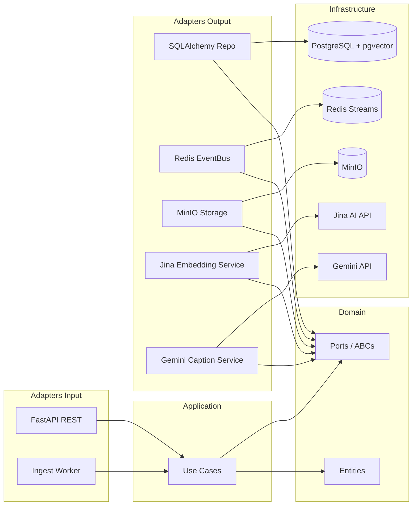
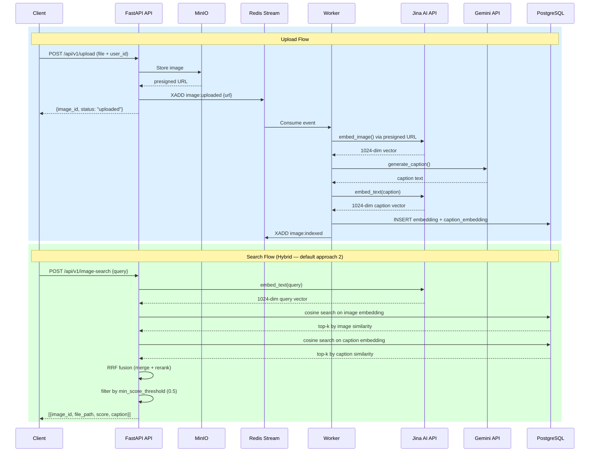

# Beekid Image Search

Text-to-image search service for the Beekid education platform. Uses Jina AI cloud embeddings stored in PostgreSQL + pgvector, with MinIO for image storage and Redis Streams for event-driven processing.

## Quick Start (Docker)

### 1. Environment Variables

Create `.env` file (copy from `.env.example`):

```bash
cp .env.example .env
```

Required variables:

| Variable | Description |
|---|---|
| `IMAGE_SEARCH_JINA_API_KEY` | Jina AI API key (get at [jina.ai](https://jina.ai)) |
| `IMAGE_SEARCH_GEMINI_API_KEY` | Google Gemini API key (for caption generation) |

### 2. Start Services

```bash
docker compose up -d
```

This starts 7 services:

| Service | Port | Description |
|---|---|---|
| postgres | 5432 | PostgreSQL + pgvector |
| redis | 6379 | Redis Streams |
| minio | 9000, 9001 | S3-compatible object storage (API, Console) |
| minio-init | — | Creates bucket (runs once) |
| migrate | — | Runs Alembic migrations (runs once) |
| api | 8000 | FastAPI REST server |
| worker | — | Ingest worker (Jina embeddings + Gemini captions) |

### 3. Verify

```bash
curl http://localhost:8000/health
```

## API Endpoints

| Method | Path | Description |
|---|---|---|
| `POST` | `/api/v1/upload` | Upload image to MinIO, trigger auto-ingest pipeline |
| `POST` | `/api/v1/image-search` | Text-to-image search (3 approaches: pure CLIP, hybrid caption, multimodal RAG) |
| `GET` | `/images/{image_id}` | Get image metadata and status |
| `DELETE` | `/images/{image_id}` | Delete image and its embeddings |
| `GET` | `/health` | Health check (Redis + PostgreSQL) |

## Search Approaches

| # | Name | How it works | Speed | Cost |
|---|---|---|---|---|
| 1 | Pure CLIP | Cosine search on image embedding only | ~50ms | Free |
| 2 | Hybrid Caption | Cosine on image + caption embeddings, fused with RRF (default) | ~200ms | Free |
| 3 | Multimodal RAG | Hybrid search + Gemini generates answer from top images | ~500ms | ~$0.00004/query |

Results below `min_score_threshold` (default 0.5) are filtered out.

## Resource Usage (Docker)

Approximate memory usage with Jina cloud API (no local ML models):

| Service | RAM |
|---|---|
| worker | ~145 MiB |
| api | ~116 MiB |
| minio | ~70 MiB |
| postgres | ~25 MiB |
| redis | ~4 MiB |
| **Total** | **~360 MiB** |

## Local Development

```bash
uv sync --extra dev               # install deps
cp .env.example .env               # configure env vars
docker compose up -d postgres redis minio minio-init  # start infra
uv run alembic upgrade head        # run migrations
uv run uvicorn image_search.adapters.input.app:app --host 0.0.0.0 --port 8000 --reload  # API
uv run python -m image_search.adapters.input.ingest_worker  # worker
```

### Quality Gates

```bash
make check       # all gates (lint + format + typecheck + test)
make test        # unit tests only
make lint        # ruff check
make format      # ruff format
make typecheck   # mypy
make help        # all commands
```

## Architecture

**Clean Architecture dependency flow:**



**Data flow — Upload & Search:**



## Specs

Implementation specs: `docs/specs/image-search/IS-001..IS-015`
