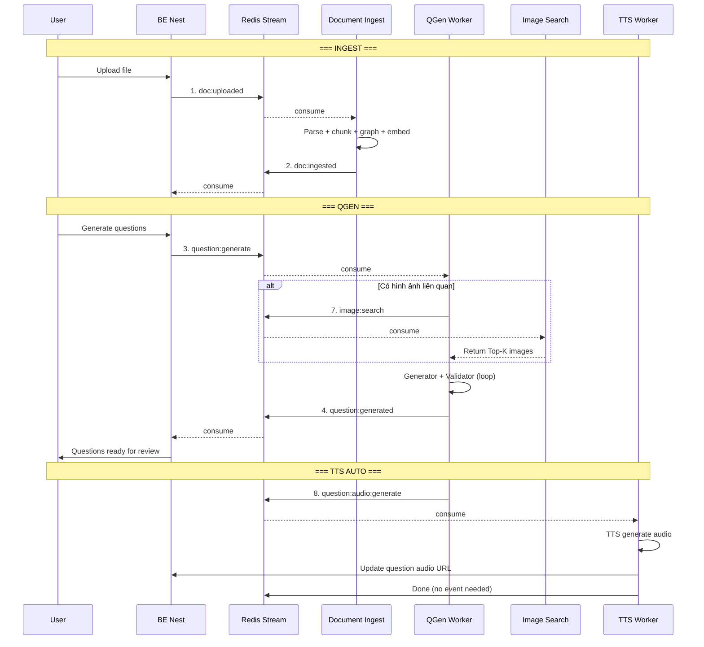
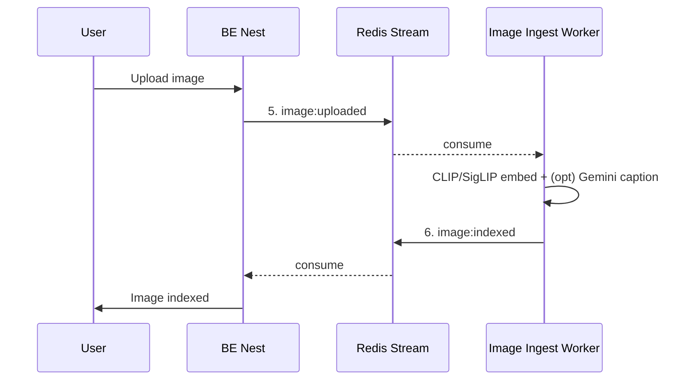
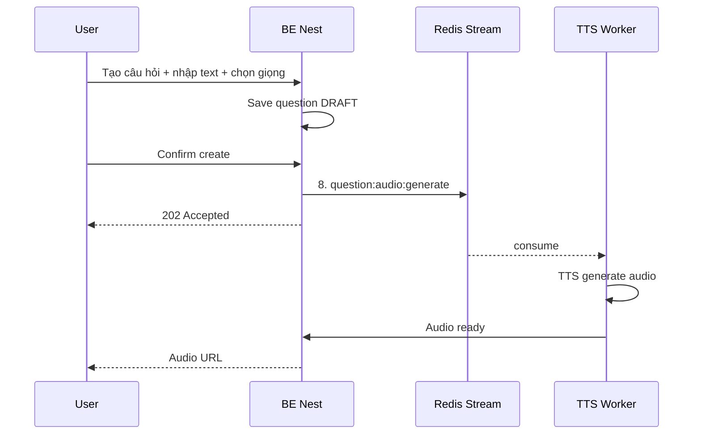
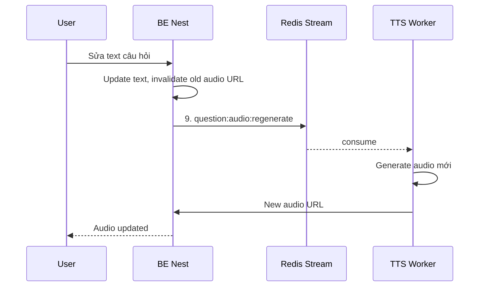
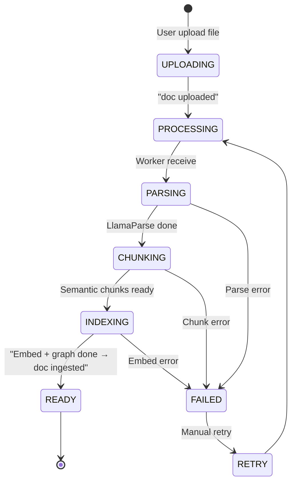
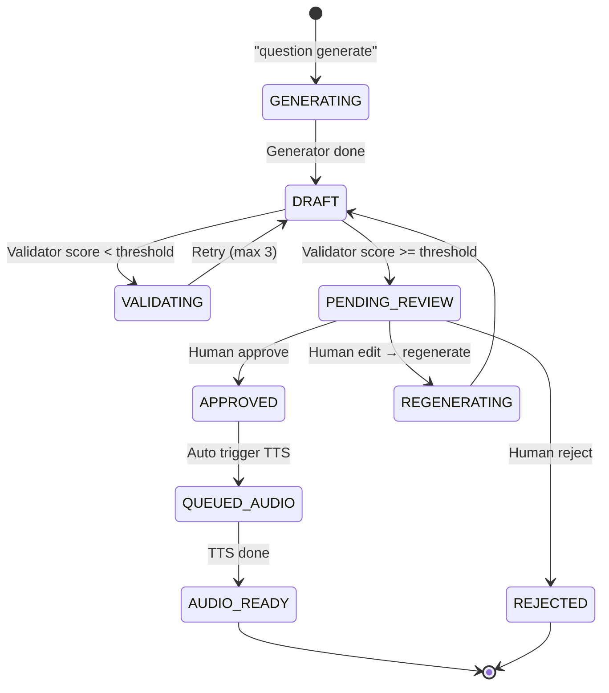
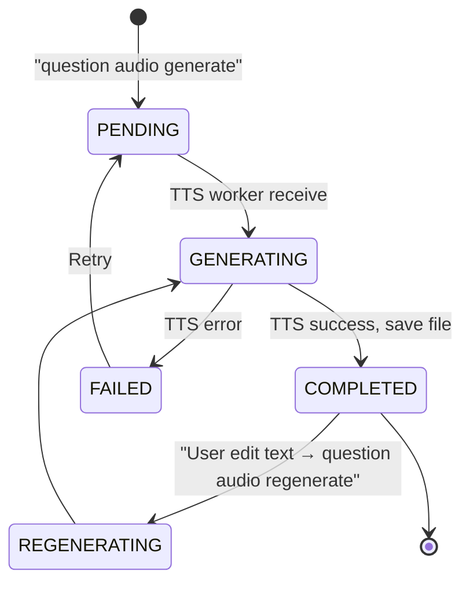
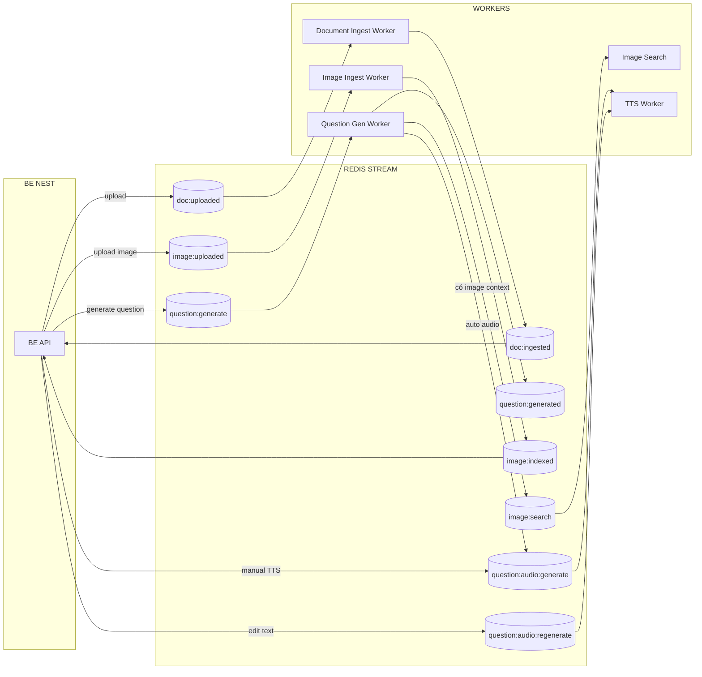

# Beekid AI Platform — Data & Event Flow Xuyên suốt Hệ thống

> Tài liệu này mô tả toàn bộ luồng dữ liệu và event giữa các module.
> Kết hợp thông tin từ 3 tài liệu kiến trúc con.

---

## 1. Tất cả Redis Stream Events

| # | Event | Producer | Consumer | Payload | Module gốc |
|---|---|---|---|---|---|
| 1 | `doc:uploaded` | BE Nest | Document Ingest Worker | `{ doc_id, file_path, user_id }` | QGen |
| 2 | `doc:ingested` | Document Ingest Worker | BE Nest | `{ doc_id, status: "ready" }` | QGen |
| 3 | `question:generate` | BE Nest | Question Gen Worker | `{ doc_id, params, request_id }` | QGen |
| 4 | `question:generated` | Question Gen Worker | BE Nest | `{ request_id, questions[] }` | QGen |
| 5 | `image:uploaded` | BE Nest | Image Ingest Worker | `{ image_id, file_path, user_id }` | Image Search |
| 6 | `image:indexed` | Image Ingest Worker | BE Nest | `{ image_id, status: "indexed" }` | Image Search |
| 7 | `image:search` | QGen Worker | Image Search Service | `{ query, top_k }` | Image Search |
| 8 | `question:audio:generate` | BE Nest / QGen Worker | TTS Worker | `{ question_id, text, voice_id, speed, language }` | TTS |
| 9 | `question:audio:regenerate` | BE Nest | TTS Worker | `{ question_id, text, voice_id, speed, language }` | TTS |

---

## 2. Event Chains

### 2a. Document → Question → Audio

### 2b. Image Ingest độc lập

### 2c. TTS Manual — Audio khi user tạo câu hỏi thủ công

### 2d. Edit text → Regenerate audio

---

## 3. Data Lifecycle

### 3a. Document Lifecycle

### 3b. Question Lifecycle

### 3c. Audio Lifecycle

---

## 4. Consumer Groups — Redis Stream

| Stream | Consumer Group | Consumers | Ghi chú |
|---|---|---|---|
| `doc:uploaded` | `doc-ingest` | Document Ingest Worker | 1 consumer (có thể scale) |
| `question:generate` | `qgen` | Question Gen Worker | 1 consumer |
| `image:uploaded` | `img-ingest` | Image Ingest Worker | 1 consumer |
| `image:search` | `img-search` | Image Search Service | Có thể nhiều workers |
| `question:audio:generate` | `tts` | TTS Worker | 1 consumer |
| `question:audio:regenerate` | `tts` | TTS Worker | Cùng group với generate |

---

## 5. Tổng quan Event Flow

---

## 6. File kiến trúc liên quan

| File | Nội dung |
|---|---|
| [`system-overview.md`](./system-overview.md) | Tổng quan kiến trúc toàn hệ thống |
| [`rag-hybrid-question-generation.md`](./rag-hybrid-question-generation.md) | Chi tiết Document Ingest + Question Generation + HITL |
| [`image-search.md`](./image-search.md) | Chi tiết Image Search (3 approaches) |
| [`text-to-speech.md`](./text-to-speech.md) | Chi tiết TTS (event-driven, strategy pattern) |
