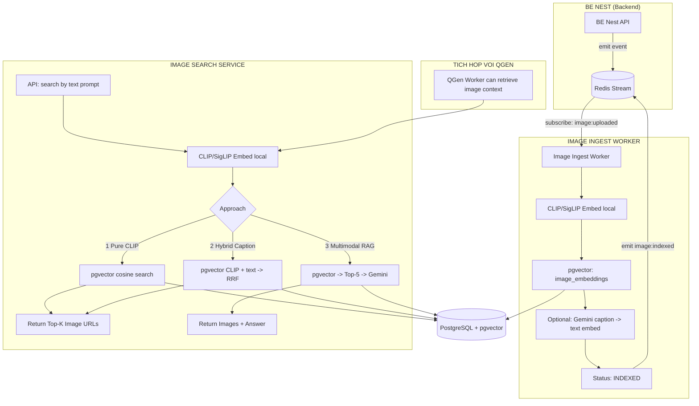
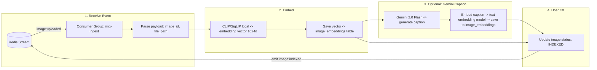
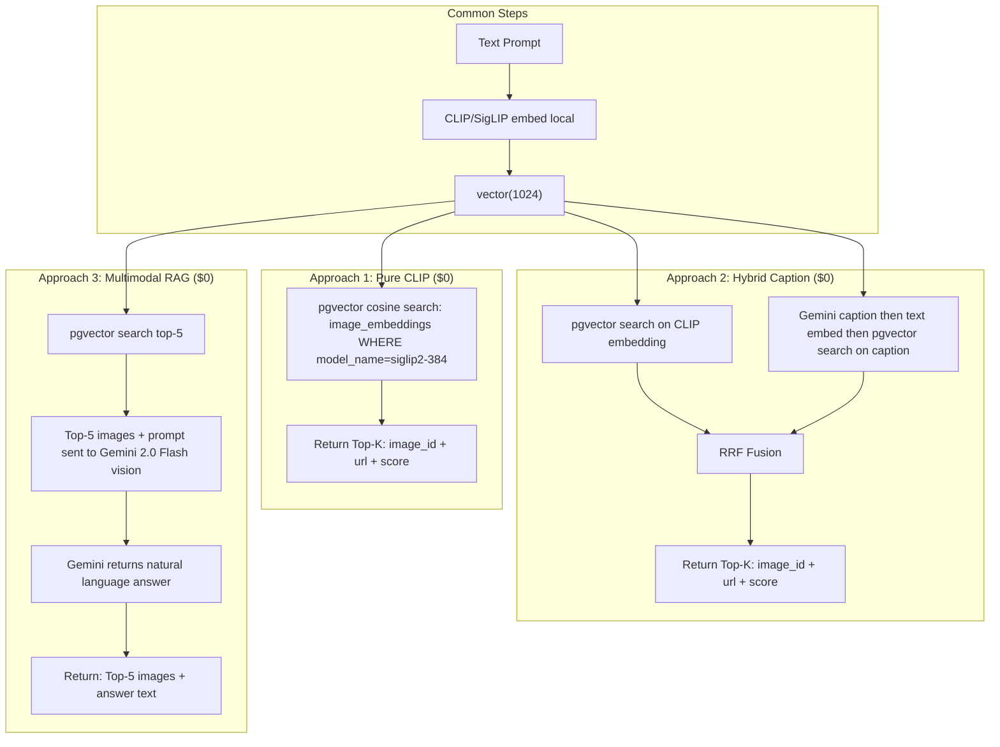
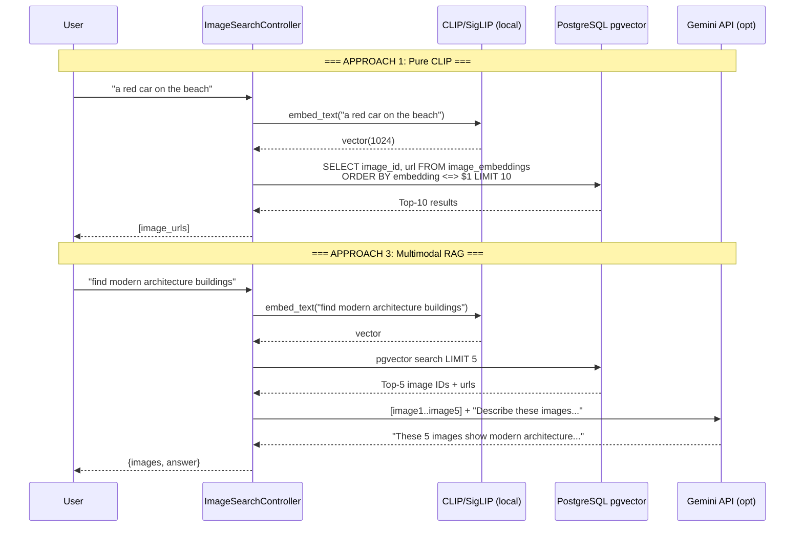
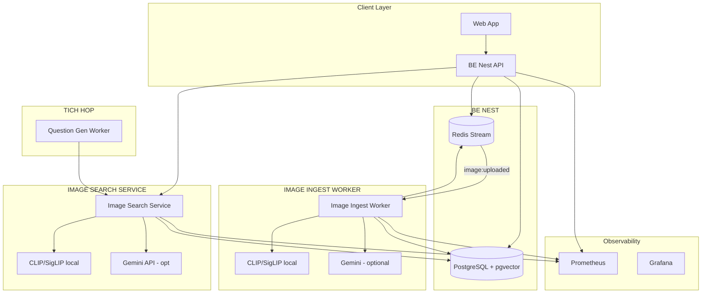

# Kiến trúc Image Search Service — Text-to-Image Retrieval

> **Nguyên tắc**: Module độc lập, event-driven. BE Nest emit event qua Redis Stream, AI workers consume.
> Có thể đứng riêng hoặc tích hợp với Question Generation.

## 1. Tổng quan - Event-Driven



### Redis Stream Events

| Event | Producer | Consumer | Payload |
|---|---|---|---|
| `image:uploaded` | BE Nest | Image Ingest Worker | `{ image_id, file_path, user_id }` |
| `image:indexed` | Image Ingest Worker | BE Nest (callback) | `{ image_id, status: "indexed" }` |
| `image:search` | QGen Worker | Image Search Service | `{ query, top_k }` |

---

## 2. Image Ingest Worker

Subscribe `image:uploaded` từ Redis Stream.



---

## 3. Image Search — 3 Approaches

Config-driven: chỉ cần thay đổi `ImageSearch.Approach = 1 | 2 | 3`.

### 3a. Tổng quan 3 Approaches



### 3b. Sequence chi tiết



---

## 4. So sánh 3 Approaches

| Approach | Chi phí | Chất lượng | Độ trễ | Khi nào dùng |
|---|---|---|---|---|
| **1. Pure CLIP** | $0 | 70-85% | ~50ms | MVP, search nhanh, ít vốn |
| **2. Hybrid Caption** | ~$0.40/10K ảnh* | 80-92% | ~200ms | Cần độ chính xác cao |
| **3. Multimodal RAG** | ~$0.20/1K queries* | 85-95% | ~500ms | Cần giải thích, chat với ảnh |
| **1+3 kết hợp** | $0-$0.20/1K queries | 85-95% | ~100ms + ~400ms | Default recommend |

*Gemini 2.0 Flash paid pricing

---

## 5. Kiến trúc Deployment



---

## 6. Công nghệ

| Component | Cong nghe | Cost |
|---|---|---|
| **Backend** | BE Nest (Node.js/NestJS) | $0 |
| **Image Embedding** | SigLIP 2 (local, open-source) | $0 |
| **Vector Store** | PostgreSQL + pgvector | $0 (da co) |
| **LLM Caption/Answer** | Gemini 2.0 Flash | $0 (free) hoac ~$0.00004/req |
| **Event Bus** | Redis Stream | $0 (da co hoac tu host) |
| **Database** | PostgreSQL | $0 (da co) |

### Model embedding khuyến nghị

| Model | Dim | Quality | Speed | Source |
|---|---|---|---|---|
| `clip-ViT-B-32` | 512 | 63% ImageNet | Nhanh | OpenAI |
| `clip-ViT-L-14` | 768 | 75% ImageNet | Trung binh | OpenAI |
| `ViT-SO400M-16-SigLIP2-384` | 1024 | ~82% ImageNet | Cham nhat | Google (top 1) |

---

## 7. Tích hợp với Question Generation

Khi QGen Worker cần tạo câu hỏi có tham chiếu hình ảnh (VD: biểu đồ trong slide, ảnh chụp màn hình, hình minh họa):

```text
QGen Worker nhận event question:generate từ BE Nest

    ├── [text context] LightRAG retrieval → chunks + entities
    │
    └── [image context] Gọi Image Search Service với query = nội dung liên quan
                        ──▶ Image Search trả về Top-5 ảnh + caption
                        ──▶ QGen đưa cả text + image URLs vào context của Generator
                        ──▶ Generator tạo câu hỏi (MCQ/open-ended) từ cả text và hình ảnh
```

Hoặc QGen Worker có thể emit event `image:search` qua Redis Stream để Image Search Service xử lý async.

---

## 8. Lộ trình implement

| Phase | Noi dung | Thoi gian |
|---|---|---|
| **1. Redis Stream setup** | Define events, consumer groups | 1 ngay |
| **2. Image Ingest Worker** | Subscribe image:uploaded, CLIP embed + pgvector | 2-3 ngay |
| **3. Approach 1** | Pure CLIP search, API endpoint | 1 ngay |
| **4. Approach 2** | Gemini caption -> dual search -> RRF | 2 ngay |
| **5. Approach 3** | Multimodal RAG with Gemini vision | 1-2 ngay |
| **6. Tích hợp QGen** | QGen gọi Image Search cho context | 1 ngay |
