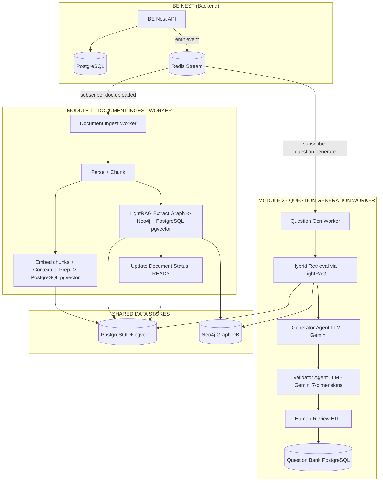
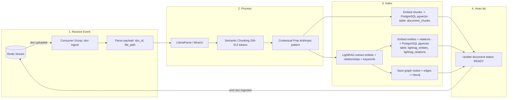
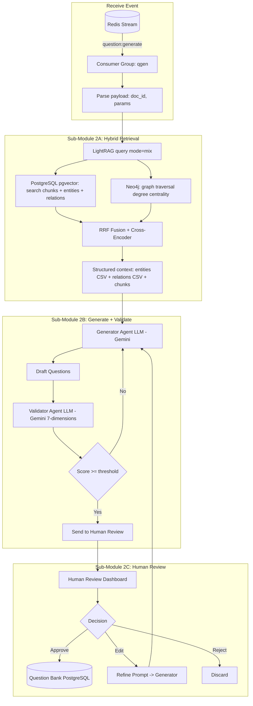
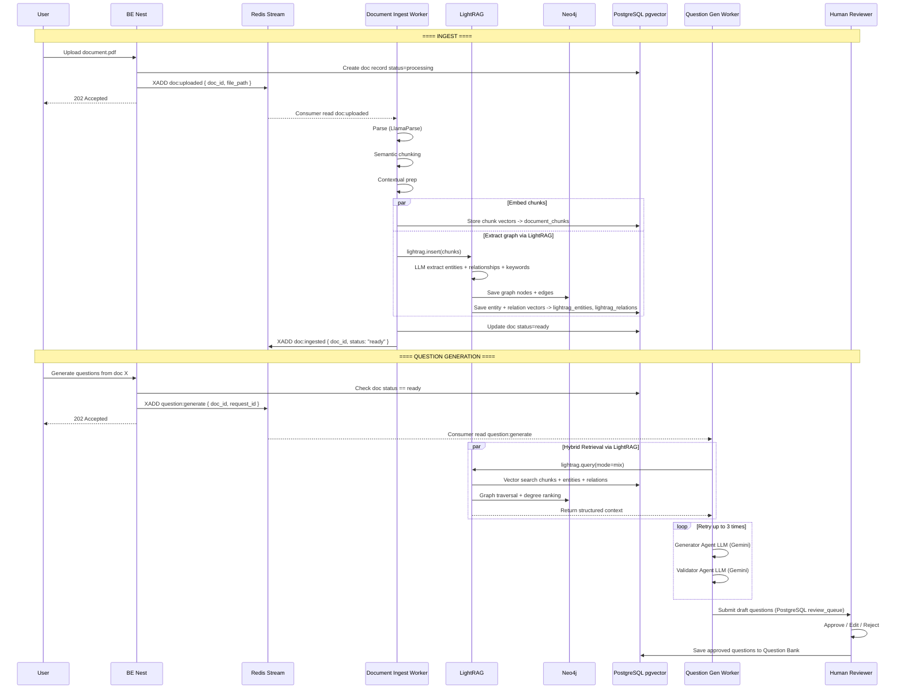
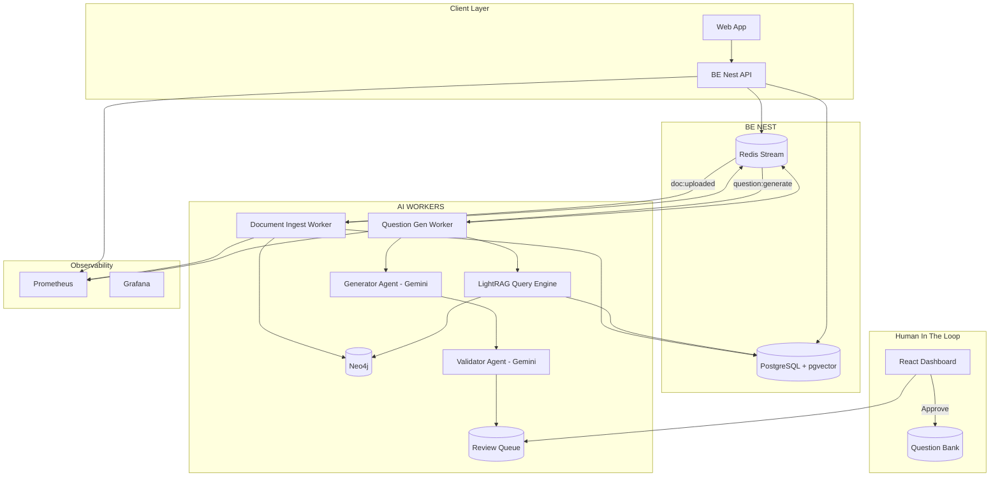

# Kiến trúc Hybrid GraphRAG cho Question Generation + Human-in-the-Loop

> **Nguyên tắc**: Hệ thống tách làm **2 module độc lập**, giao tiếp qua event-driven architecture.
> - **BE Nest** xử lý upload, emit event qua Redis Stream
> - **AI services** subscribe Redis Stream, xử lý background

## 1. Tổng quan - Event-Driven Architecture

### Redis Stream Events

| Event | Producer | Consumer | Payload |
|---|---|---|---|
| `doc:uploaded` | BE Nest | Document Ingest Worker | `{ doc_id, file_path, user_id }` |
| `doc:ingested` | Document Ingest Worker | BE Nest (callback) | `{ doc_id, status: "ready" }` |
| `question:generate` | BE Nest | Question Gen Worker | `{ doc_id, params, request_id }` |
| `question:generated` | Question Gen Worker | BE Nest (callback) | `{ request_id, questions[] }` |

---

## 2. Module 1: Document Ingest Worker

Subscribe `doc:uploaded` từ Redis Stream, xử lý background.

---

## 3. Module 2: Question Generation Worker

Subscribe `question:generate` từ Redis Stream.

---

## 4. Sequence: Event Flow Xuyên suốt

---

## 5. Kiến trúc Deployment

> **Vê hình ảnh**: Nếu câu hỏi cần tham chiếu đên hình ảnh (VD: sinh câu hỏi từ biểu đồ, ảnh minh họa trong tài liệu), QGen Worker sẽ gọi **Image Search Service** (xem docs riêng: `image-search.md`) để retrieve ảnh liên quan và đưa vào context cho Generator Agent.

---

## 6. Công nghệ đề xuất

| Component | Cong nghe |
|---|---|
| **Backend** | BE Nest (Node.js/NestJS) |
| **Document Parsing** | LlamaParse / MinerU |
| **Semantic Chunking** | LangChain Recursive + Semantic |
| **Contextual Prep** | Anthropic pattern |
| **Graph RAG Engine** | LightRAG |
| **Vector Store** | PostgreSQL + pgvector |
| **Graph Store** | Neo4j |
| **Event Bus** | Redis Stream |
| **LLM** | Gemini 2.0 Flash (free/paid) |
| **Orchestration** | LangGraph |
| **Database** | PostgreSQL |
| **Human Review UI** | Custom React / Label Studio |
| **Monitoring** | Prometheus + Grafana |

---

## 7. Lộ trình implement

| Phase | Noi dung | Thoi gian |
|---|---|---|
| **1. Migrate Qdrant → pgvector** | Thêm pgvector extension, migrate data, xóa Qdrant | 2-3 ngay |
| **2. Redis Stream setup** | Define events, consumer groups | 1 ngay |
| **3. Document Ingest Worker** | Subscribe doc:uploaded, parse + embed + LightRAG | 2-3 ngay |
| **4. Hybrid Retrieval** | Kết hợp LightRAG query + pgvector + Neo4j | 1-2 ngay |
| **5. Generator + Validator** | Gemini-based generate + validate loop | 2-3 ngay |
| **6. HITL Dashboard** | Human review queue, approve/edit/reject | 2-3 ngay |
| **7. Enterprise Hardening** | Multi-tenant, monitoring | 1-2 tuan |

---

## 8. Chi phí vận hành hàng tháng

| Item | Before (Qdrant) | After (pgvector) |
|---|---|---|
| Vector DB | $0 (self-host Qdrant) + RAM | $0 (PostgreSQL da co) |
| Event Bus | RabbitMQ (self-host) | Redis Stream (co the dung Redis co san) |
| LLM (QGen) | $10-50 (GPT-4o) | $0-5 (Gemini Flash) |
| Infra services | PostgreSQL + Qdrant + Neo4j + RabbitMQ | PostgreSQL + Neo4j + Redis |
| **Tong** | **$10-50+/thang** | **$0-5/thang** |
