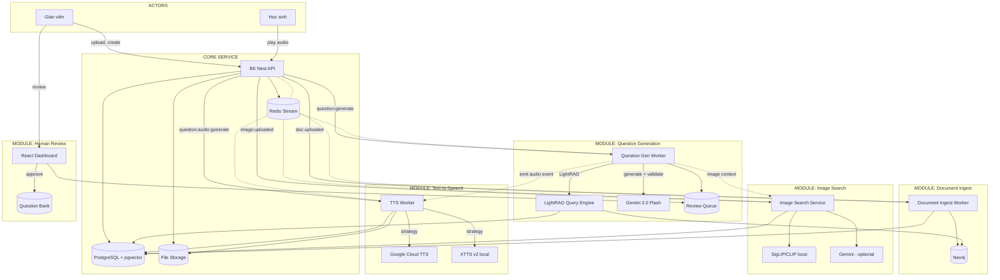
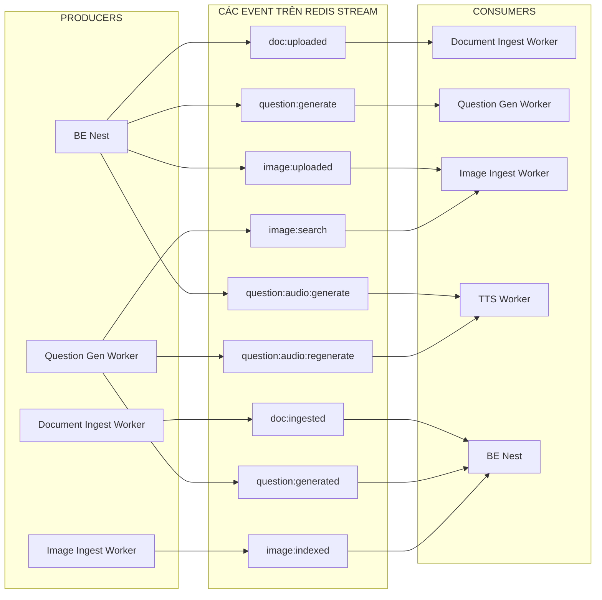
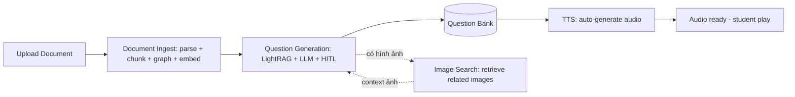

# Beekid AI Platform — Kiến trúc Hệ thống Tổng quan

> Tài liệu này mô tả toàn bộ kiến trúc Beekid AI Platform ở mức hệ thống.
> Các module chi tiết được tham chiếu ở cuối tài liệu.

## 1. System Context

```mermaid
C4Context
    Person(teacher, "Giáo viên", "Người dùng chính: soạn tài liệu, tạo câu hỏi, phê duyệt")
    Person(student, "Học sinh", "Người dùng cuối: làm bài tập, nghe audio")

    System_Boundary(boundary, "Beekid AI Platform") {
        System(be, "BE Nest API", "Backend chính, emit events, serve API")
        SystemDb(pg, "PostgreSQL + pgvector", "Dữ liệu chính + vector embeddings")
        SystemDb(neo4j, "Neo4j", "Graph entities + relationships")
        SystemQueue(redis, "Redis Stream", "Event bus bất đồng bộ")
        System(ingest, "Document Ingest Worker", "Parse + chunk + index documents")
        System(qgen, "Question Gen Worker", "Hybrid GraphRAG + LLM generate câu hỏi")
        System(imagesearch, "Image Search Service", "Text-to-Image retrieval")
        System(tts, "TTS Worker", "Text-to-Speech auto-generate audio")
        System(review, "Human Review Dashboard", "HITL: duyệt/sửa/từ chối câu hỏi")
        System(storage, "File Storage", "Lưu MP3, images, documents")
    }

    Rel(teacher, be, "Upload tài liệu, tạo câu hỏi, duyệt review")
    Rel(teacher, review, "Approve/Edit/Reject câu hỏi draft")
    Rel(student, be, "Làm bài tập, play audio câu hỏi")
    Rel(be, redis, "Emit events")
    Rel(be, pg, "CRUD")
    Rel(be, storage, "Serve files")
    Rel(ingest, redis, "Subscribe: doc:uploaded")
    Rel(ingest, pg, "Save chunks + embeddings")
    Rel(ingest, neo4j, "Save graph nodes + edges")
    Rel(qgen, redis, "Subscribe: question:generate")
    Rel(qgen, pg, "Vector search + entities + relations")
    Rel(qgen, neo4j, "Graph traversal")
    Rel(imagesearch, pg, "Vector search image embeddings")
    Rel(imagesearch, bee, "API: image search")
    Rel(tts, redis, "Subscribe: question:audio:generate")
    Rel(tts, storage, "Save audio MP3")
    Rel(tts, pg, "Update question audio status")
    Rel(qgen, imagesearch, "Lấy context ảnh cho generator")
    Rel(tts, bee, "Gọi BE callback khi audio xong")
```

> **Lưu ý**: C4Context là Mermaid mở rộng, có thể không render trên tất cả platform.
> Xem diagram tương đương ở mục 2 bên dưới.

---

## 2. Tổng quan — Các Subsystem



---

## 3. Shared Infrastructure

| Component | Công nghệ | Mục đích | Kiến trúc chi tiết |
|---|---|---|---|
| **PostgreSQL + pgvector** | PostgreSQL 16 + pgvector extension | Lưu tất cả dữ liệu + vector embeddings (chunks, entities, relations, images) | [`rag-hybrid-question-generation.md`](./rag-hybrid-question-generation.md), [`image-search.md`](./image-search.md) |
| **Neo4j** | Neo4j 5.x | Graph knowledge base: entities + relationships từ LightRAG | [`rag-hybrid-question-generation.md`](./rag-hybrid-question-generation.md) |
| **Redis Stream** | Redis 7.x | Event bus: emit + subscribe pattern, consumer groups | Cả 3 tài liệu |
| **File Storage** | Local / S3-compatible | Lưu tài liệu gốc, images, audio MP3 | [`text-to-speech.md`](./text-to-speech.md) |
| **Gemini API** | Gemini 2.0/2.5 Flash | LLM cho QGen (generate + validate), Image Search caption, TTS | Cả 3 tài liệu |

---

## 4. Redis Stream Event Bus

Tất cả module giao tiếp bất đồng bộ qua Redis Stream. Event flow tổng thể:



Chi tiết từng event xem tại [`data-event-flow.md`](./data-event-flow.md).

---

## 5. Module chi tiết

| Module | File kiến trúc | Chức năng chính |
|---|---|---|
| **Document Ingest + Question Generation** | [`rag-hybrid-question-generation.md`](./rag-hybrid-question-generation.md) | Parse document → chunk → LightRAG index → Hybrid Retrieval → Generator + Validator → HITL |
| **Image Search** | [`image-search.md`](./image-search.md) | 3 approaches: Pure CLIP / Hybrid Caption / Multimodal RAG, all dùng pgvector |
| **Text-to-Speech** | [`text-to-speech.md`](./text-to-speech.md) | Event-driven TTS, Strategy pattern (Google / Gemini / XTTS v2), cache + serve static |

---

## 6. Flow tổng thể: Document → Audio



---

## 7. Công nghệ toàn hệ thống

| Layer | Công nghệ | Cost |
|---|---|---|
| **Backend** | BE Nest (NestJS) | $0 |
| **Database** | PostgreSQL + pgvector | $0 (có sẵn) |
| **Graph DB** | Neo4j 5.x | $0 (self-host) |
| **Event Bus** | Redis Stream | $0 (có sẵn) |
| **Vector Search** | pgvector | $0 (trong PostgreSQL) |
| **LLM** | Gemini 2.0/2.5 Flash | $0 (free tier) / ~$0.15/1M tokens |
| **Image Embedding** | SigLIP 2 (local) | $0 |
| **Image Caption** | Gemini 2.0 Flash | $0 (free tier) |
| **TTS (default)** | Google Cloud TTS | $0 (1M chars free/tháng) |
| **TTS (optional)** | XTTS v2 (self-host) | $0 (cần GPU) |
| **Document Parse** | LlamaParse / MinerU | $0 / $10-15/tháng |
| **File Storage** | Local / S3 | $0 - thấp |
| **Monitoring** | Prometheus + Grafana | $0 |
