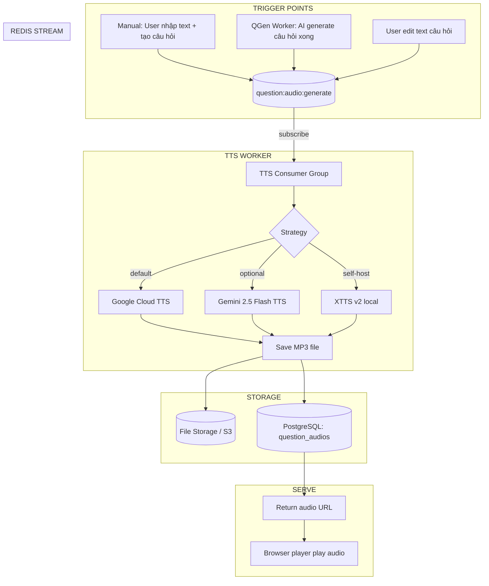
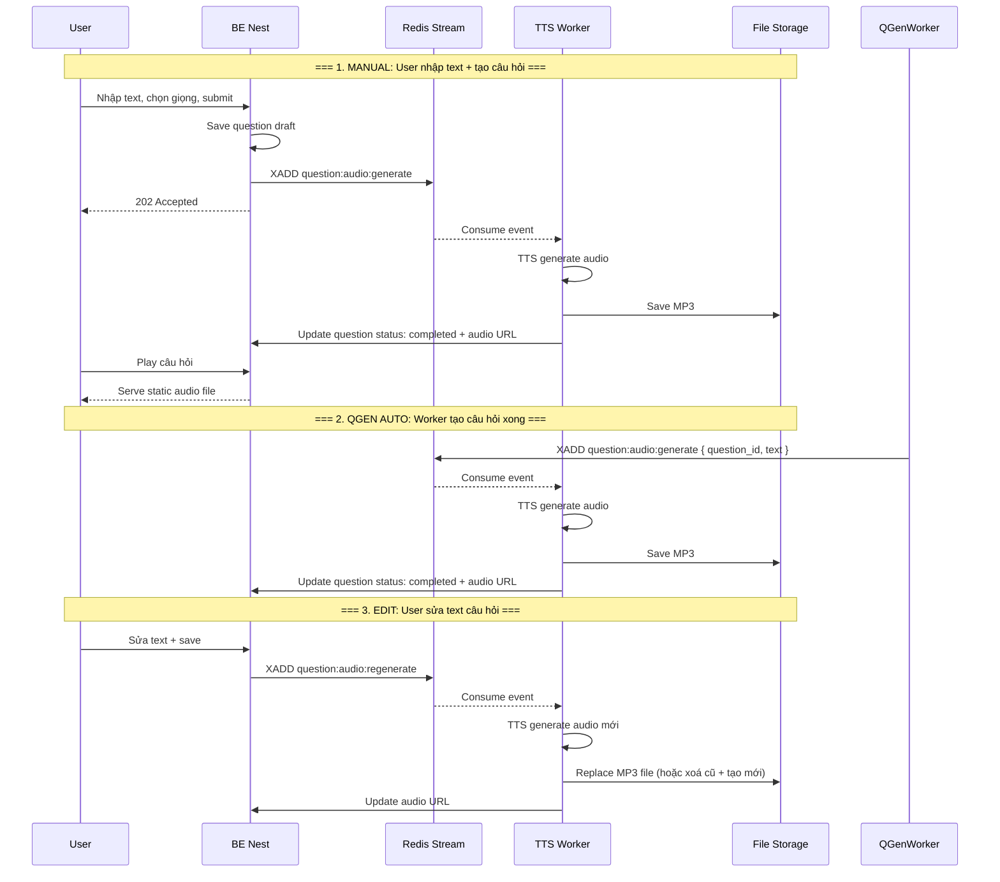
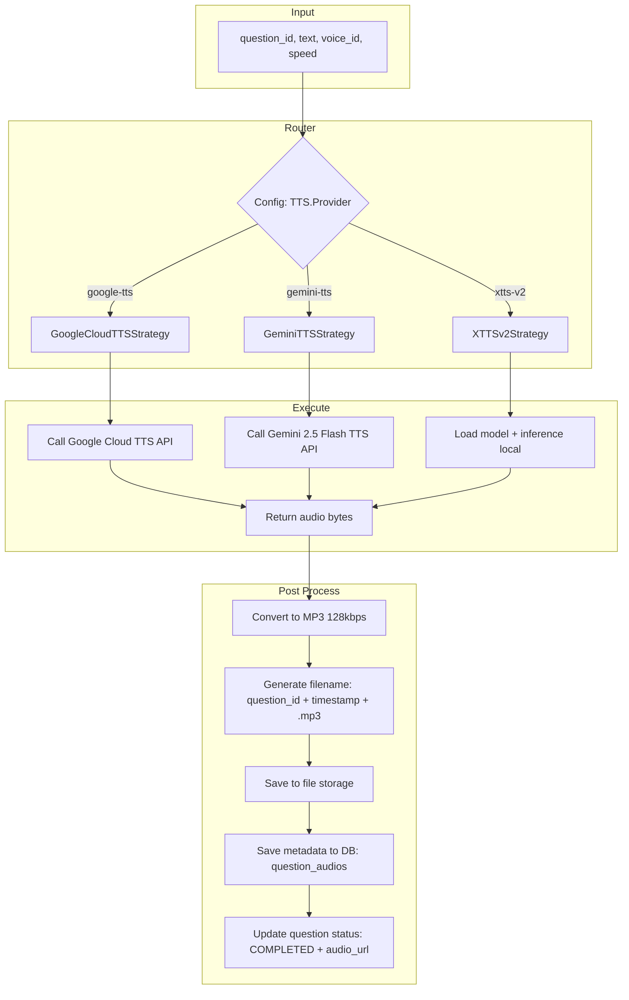
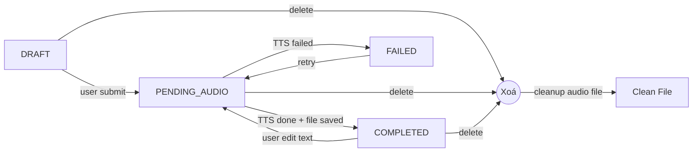
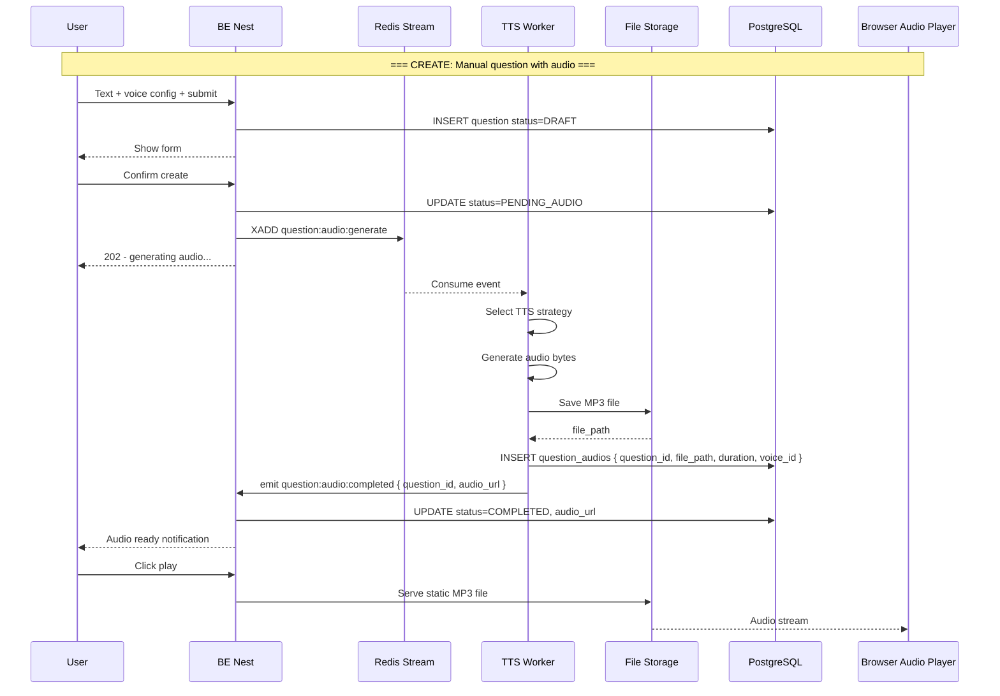
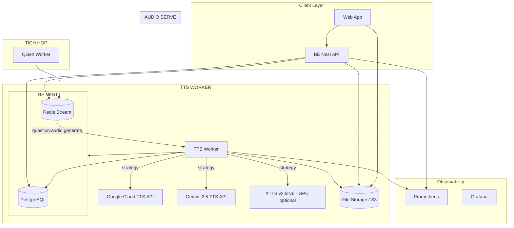

# Kiến trúc Text-to-Speech Service — Auto-generate Audio cho Câu hỏi

> **Nguyên tắc**: Event-driven, auto-generate audio khi câu hỏi được tạo (manual hoặc AI).
> Audio được lưu cache, serve tĩnh — không generate lại mỗi lần play.

## 1. Tổng quan — Event-Driven



### Redis Stream Events

| Event | Producer | Consumer | Payload |
|---|---|---|---|
| `question:audio:generate` | BE Nest (manual) / QGen Worker | TTS Worker | `{ question_id, text, voice_id, speed, language }` |
| `question:audio:regenerate` | BE Nest (khi edit text) | TTS Worker | `{ question_id, text, voice_id, speed, language }` |

---

## 2. Trigger Points — 3 cách kích hoạt



---

## 3. TTS Worker — Strategy Pattern



### Code concept — Strategy selection

```text
Cấu hình:
{
  "TTS": {
    "Provider": "google-tts",       // google-tts | gemini-tts | xtts-v2
    "GoogleCloud": {
      "Voice": "vi-VN-Wavenet-A",   // Female
      "Language": "vi-VN",
      "Speed": 1.0,
      "SampleRate": 24000
    },
    "Gemini": {
      "Voice": "Kore",              // 30 HD voices
      "Language": "vi-VN",
      "Temperature": 0.4
    },
    "XttsV2": {
      "ModelPath": "./models/xtts-v2",
      "SpeakerWav": "./voices/teacher1.wav",
      "Device": "cuda"
    }
  }
}
```

---

## 4. Audio Lifecycle — Question Status



### Status transitions:

| Status | Ý nghĩa | Audio URL |
|---|---|---|
| `DRAFT` | User đang soạn, chưa submit | null |
| `PENDING_AUDIO` | Đã submit, chờ TTS worker | null |
| `COMPLETED` | TTS xong, có audio | ✅ URL |
| `FAILED` | TTS lỗi | null |
| Edit text | Về lại `PENDING_AUDIO`, URL cũ invalid | null |

---

## 5. Audio Caching Decision

| Tiêu chí | Lưu cache | Không lưu (generate mỗi lần) |
|---|---|---|
| **Chi phí TTS** | ✅ Chỉ tốn 1 lần | ❌ Tốn N lần (N học sinh × M lần nghe) |
| **Tốc độ play** | ✅ Instant (serve file) | ❌ ~1-3s chờ mỗi lần |
| **Consistency** | ✅ Cùng text = cùng giọng | ❌ Có thể khác nhau |
| **Edit text** | ❌ Phải regen + cleanup | ✅ Tự động fix |
| **Storage** | ~50-100KB/câu = 1GB/10K câu | $0 |

**Phân tích storage:**
- 100,000 câu hỏi × 80KB ≈ **8GB** — không đáng kể so với lợi ích
- Xoá question → cleanup audio tương ứng

**Quyết định: LƯU CACHE. Trả về static file URL (không streaming).**

---

## 6. Sequence — Xuyên suốt



---

## 7. Voice Management

### 7a. Voice options per provider

| Provider | Voices | Tiếng Việt | Giá |
|---|---|---|---|
| **Google Cloud TTS** | 8 voices (4 nữ, 4 nam), Standard/WaveNet/Neural2 | ✅ | $0 (free 1M chars/tháng) |
| **Gemini 2.5 Flash TTS** | 30 HD voices, natural-language steering | ❓ Cần verify | $0.30/1M input + $2.50/1M output |
| **XTTS v2** (self-host) | Clone unlimited voices từ 6s audio | ✅ (fine-tune) | $0 (cần GPU 4GB+ VRAM) |

### 7b. Teacher-voice mapping

```text
Bảng teachers:
  - teacher_id
  - default_voice: "vi-VN-Wavenet-A"
  - tts_provider: "google-tts"

Khi tạo câu hỏi:
  User chọn giọng (nếu muốn) → lưu vào question_audios.voice_id
  Nếu không chọn → dùng default_voice của teacher
```

---

## 8. Kiến trúc Deployment



---

## 9. Công nghệ

| Component | Cong nghe | Cost |
|---|---|---|
| **TTS Provider (default)** | Google Cloud Text-to-Speech (WaveNet) | $0 (free 1M chars/tháng) |
| **TTS Provider (optional)** | Gemini 2.5 Flash TTS | $0.30/1M input tokens |
| **TTS Provider (self-host)** | XTTS v2 (Coqui) | $0 + GPU 4GB VRAM |
| **Event Bus** | Redis Stream | $0 (da co) |
| **File Storage** | Local / S3 / Cloud Storage | $0 - $rẻ |
| **Database** | PostgreSQL | $0 (da co) |
| **Audio Format** | MP3 128kbps | - |

---

## 10. Chi phí ước tính

| Scenario | Tháng | Google Cloud TTS | Ghi chú |
|---|---|---|---|
| MVP (1K câu hỏi/tháng, ~100 chars/câu) | 100K chars | **$0** | Trong free tier (1M chars) |
| Medium (10K câu/tháng, ~200 chars/câu) | 2M chars | **$4** | Vượt free tier 1M, dùng Standard $4/1M |
| Scale (100K câu/tháng, ~200 chars/câu) | 20M chars | **$64** | Standard $4/1M |
| Scale + XTTS v2 (100K câu/tháng) | Unlimited | **$0** | Chỉ tốn GPU điện |

---

## 11. Lộ trình implement

| Phase | Noi dung | Thoi gian |
|---|---|---|
| **1. Redis Stream events** | Define events, consumer group | 1 ngay |
| **2. Google Cloud TTS strategy** | API integration, save file, update DB | 2 ngay |
| **3. Trigger integration** | Manual create + QGen auto emit event | 1-2 ngay |
| **4. Audio serve + cache** | Static file URL, CDN, cleanup | 1 ngay |
| **5. Voice management** | Teacher default voice, voice selector UI | 1 ngay |
| **6. XTTS v2 strategy** | Self-host fallback, GPU inference | 2-3 ngay |
| **7. Gemini TTS strategy** | Optional upgrade, verify tiếng Việt | 1 ngay |
