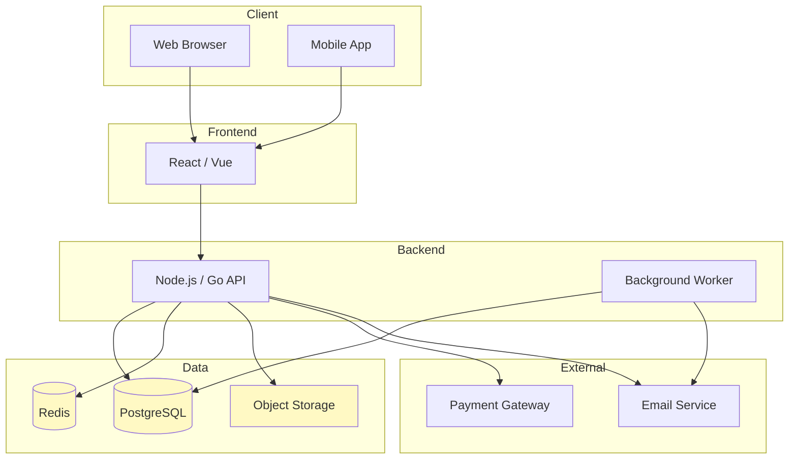
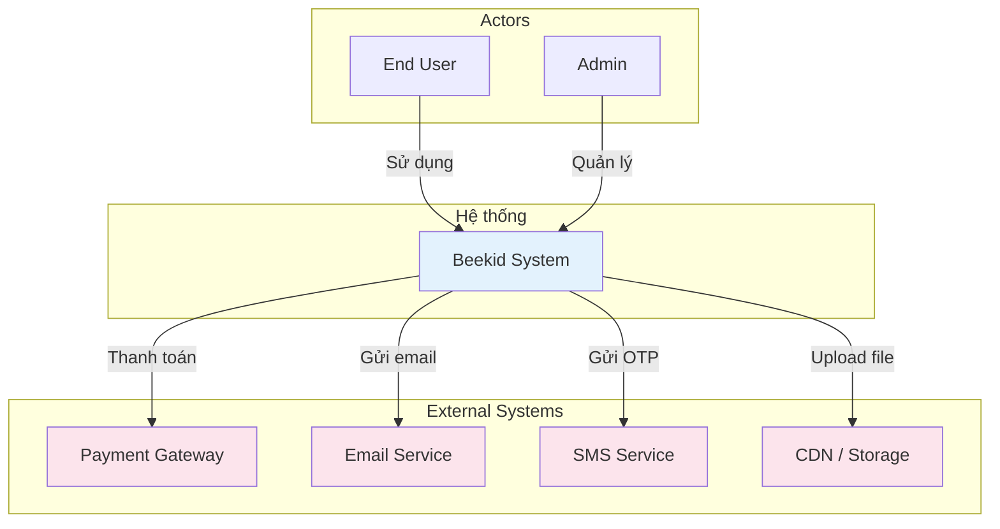
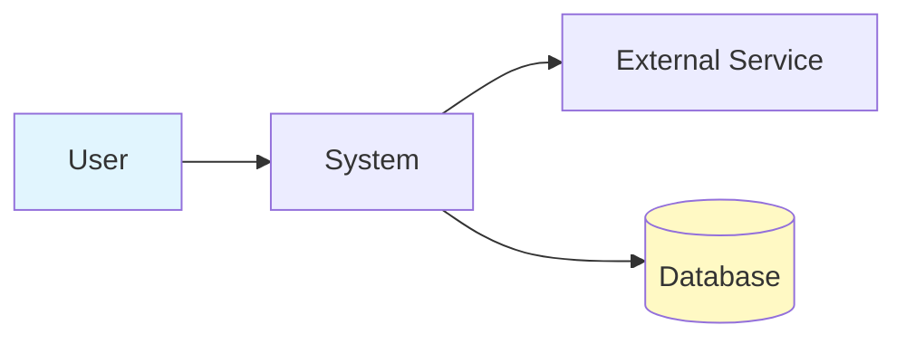

# Proposal: [Tên Feature / Solution]

> Template proposal tổng quan — trình bày vấn đề, giải pháp, và kế hoạch ở mức cao.

---

## Metadata

| Trường          | Giá trị                                 |
| --------------- | --------------------------------------- |
| **Tác giả**     | [Tên]                                   |
| **Ngày tạo**    | YYYY-MM-DD                              |
| **Status**      | Draft / In Review / Approved / Rejected |
| **Reviewer(s)** | [Tên người review]                      |
| **Tracking**    | [Link issue/ticket]                     |

---

## 1. Problem Statement

Mô tả vấn đề hiện tại một cách ngắn gọn:

- Vấn đề là gì?
- Ai bị ảnh hưởng?
- Mức độ nghiêm trọng / tần suất?
- Tại sao cần giải quyết bây giờ?

---

## 2. Tech Stack

Công nghệ hiện tại của dự án:

| Layer          | Technology         | Version | Ghi chú                     |
| -------------- | ------------------ | ------- | --------------------------- |
| **Frontend**   | [React/Vue/...]    | [x.x]   | [Ghi chú]                   |
| **Backend**    | [Node.js/Go/...]   | [x.x]   | [Ghi chú]                   |
| **Database**   | [PostgreSQL/...]   | [x.x]   | [Ghi chú]                   |
| **Cache**      | [Redis/...]        | [x.x]   | [Ghi chú]                   |
| **Auth**       | [JWT/OAuth/...]    | —       | [Ghi chú]                   |
| **Hosting**    | [AWS/GCP/...]      | —       | [Ghi chú]                   |
| **CI/CD**      | [GitHub Actions/..] | —      | [Ghi chú]                   |

### Tech Stack Diagram

---

## 3. Context Diagram

System context — hệ thống tương tác với các actors và hệ thống bên ngoài:

| Actor / Hệ thống  | Hướng    | Mô tả tương tác                    |
| ------------------ | -------- | ---------------------------------- |
| End User           | Inbound  | Sử dụng sản phẩm                  |
| Admin              | Inbound  | Quản trị hệ thống                 |
| Payment Gateway    | Outbound | Xử lý thanh toán                   |
| Email Service      | Outbound | Gửi email thông báo, xác nhận      |
| SMS Service        | Outbound | Gửi OTP xác thực                   |
| CDN / Storage      | Outbound | Lưu trữ file, hình ảnh             |

---

## 4. Proposed Solution

### Tổng quan

Mô tả giải pháp đề xuất (1-2 đoạn). Tập trung vào **cái gì** và **tại sao**, không đi sâu vào **như thế nào**.

### Solution Diagram

### Key Changes

Mô tả các thay đổi chính ở mức component/module:

- Thêm module X để xử lý Y
- Thay đổi flow hiện tại từ A sang B
- Tích hợp với service Z

---

## 5. Goals & Non-Goals

### Goals

- [ ] Mục tiêu 1 — cụ thể, đo lường được
- [ ] Mục tiêu 2
- [ ] Mục tiêu 3

### Non-Goals

- Không làm X vì lý do Y
- Không support Z trong giai đoạn này

---

## 6. Impact & Risks

### Impact

| Area       | Mức độ  | Mô tả                       |
| ---------- | ------- | ---------------------------- |
| API        | Medium  | Thêm endpoints mới           |
| Database   | High    | Migration, schema thay đổi   |
| Frontend   | Low     | Không ảnh hưởng              |
| Users      | Medium  | Thay đổi UX cho flow X       |

### Risks

| Risk                      | Likelihood | Impact | Mitigation                   |
| ------------------------- | ---------- | ------ | ---------------------------- |
| [Risk 1]                  | Low        | High   | [Cách giảm thiểu]           |
| [Risk 2]                  | Medium     | Medium | [Cách giảm thiểu]           |

---

## 7. Alternatives Considered

| Phương án             | Ưu điểm         | Nhược điểm       | Lý do reject       |
| --------------------- | ---------------- | ---------------- | ------------------ |
| **A: Đề xuất hiện tại** | Ưu điểm chính  | Nhược điểm       | — (được chọn)      |
| B: Phương án khác      | Ưu điểm         | Nhược điểm       | Lý do reject       |

---

## 8. Milestones & Timeline

- [ ] **Phase 1**: Design & Review — [Ngày]
- [ ] **Phase 2**: Implementation — [Ngày]
- [ ] **Phase 3**: Testing & QA — [Ngày]
- [ ] **Phase 4**: Deploy — [Ngày]

---

## 9. Use Cases

Liệt kê các use cases liên quan. Xem đầy đủ tại [use-case-catalog.md](./use-case-catalog.md).

| #   | Use Case        | Actor    | Brief Description                                    |
| --- | --------------- | -------- | ---------------------------------------------------- |
| 1   | [UseCaseName]   | [Actor]  | As a [actor], I want to [goal], so that [benefit]    |
| 2   | [UseCaseName]   | [Actor]  | As a [actor], I want to [goal], so that [benefit]    |

---

## 10. Open Questions

- [ ] Q1: [Câu hỏi] — cần input từ [ai]
- [ ] Q2: [Câu hỏi] — blocked bởi [what]

---

## 11. References

- [Link tài liệu liên quan]
- [Link issue/ticket gốc]
