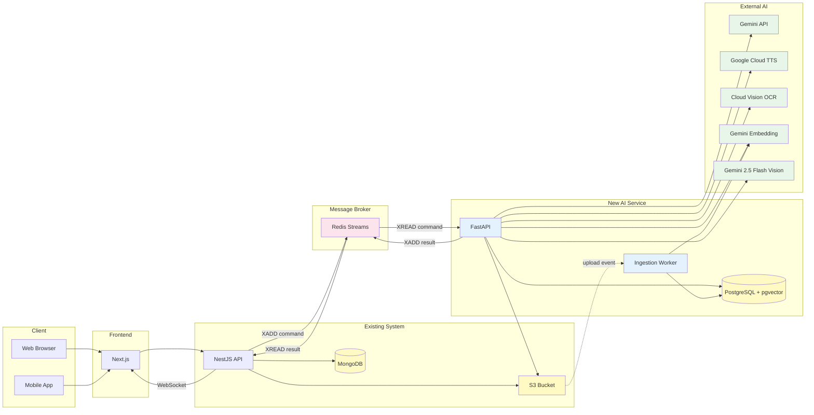
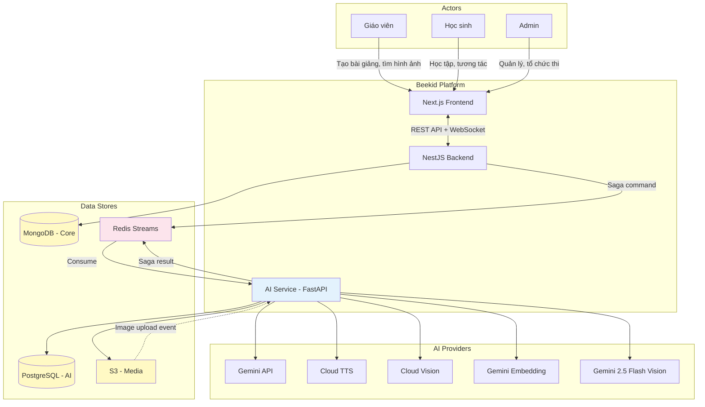
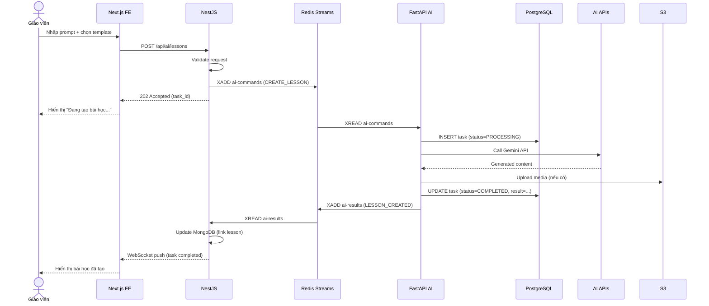
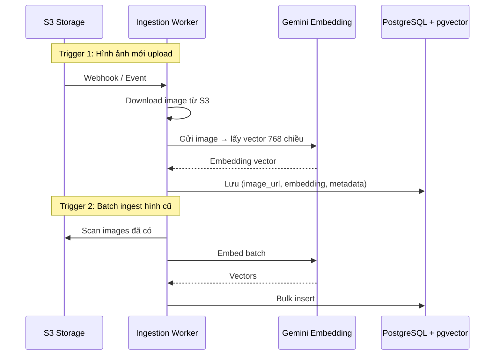
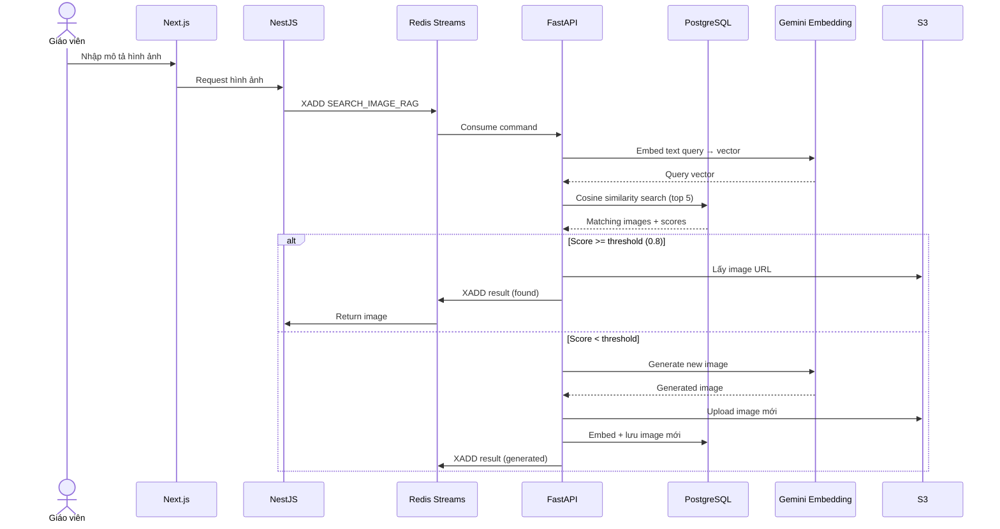

# Proposal: Beekid AI Service — Tích hợp Gemini & Genie

> Proposal thiết kế AI Microservice (FastAPI + PostgreSQL) tích hợp vào hệ thống Beekid hiện tại (Next.js + NestJS + MongoDB) thông qua Redis Streams với Saga pattern.

---

## Metadata

| Trường          | Giá trị                                 |
| --------------- | --------------------------------------- |
| **Tác giả**     | [Tên]                                   |
| **Ngày tạo**    | 2026-06-02                              |
| **Status**      | Draft                                   |
| **Reviewer(s)** | [Tên người review]                      |
| **Tracking**    | [Link issue/ticket]                     |

---

## 1. Problem Statement

Beekid là nền tảng học tập online cho trẻ em. Hệ thống hiện tại đã chạy ổn định với FE (Next.js) và Backend (NestJS + MongoDB). Tuy nhiên, thiếu các tính năng AI để hỗ trợ giáo viên tạo nội dung nhanh và học sinh có trải nghiệm tương tác.

**Vấn đề chính:**
- Tạo bài giảng mất nhiều thời gian (trung bình 2-3 giờ/bài)
- Không có tính năng text-to-speech, giáo viên phải tự thu âm
- Thiếu công cụ AI để hỗ trợ tạo câu hỏi, đáp án tự động
- Bài giảng hiện tại thiếu tính tương tác cho trẻ em
- Không có công cụ vẽ tranh/sáng tạo tích hợp cho trẻ

**Ràng buộc kỹ thuật:**
- Hệ thống hiện tại đã chạy production — không thể thay đổi kiến trúc core
- Cần service riêng cho AI để cô lập failure domain và scale riêng
- Cần đảm bảo data consistency giữa MongoDB (core) và PostgreSQL (AI) thông qua Saga pattern

---

## 2. System Architecture

### 2.1 Current System (không thay đổi)

| Component | Technology | Vai trò |
| --------- | ---------- | ------- |
| **Frontend** | Next.js (React) | UI cho giáo viên, học sinh, admin |
| **Backend** | NestJS | API server, business logic, auth |
| **Database** | MongoDB | Users, classes, core data |
| **Storage** | S3 | Hình ảnh, audio, file |

### 2.2 New AI Service

| Component | Technology | Vai trò |
| --------- | ---------- | ------- |
| **AI Service** | FastAPI (Python) | Xử lý AI tasks: Gemini, TTS, OCR, Vision |
| **AI Database** | PostgreSQL + pgvector | Lưu AI-generated content, task state, image embeddings |
| **Message Broker** | Redis Streams | Async communication, Saga orchestration |
| **Embedding Model** | Gemini Multimodal Embedding | Chuyển ảnh/text thành vector 768 chiều |
| **Vector Search** | pgvector (PostgreSQL extension) | Cosine similarity search trên image embeddings |

### 2.3 Tech Stack Diagram



### 2.4 Context Diagram



---

## 3. Communication: Redis Streams + Saga Pattern

### 3.1 Tại sao dùng Redis Streams + Saga

| Yêu cầu | Giải pháp |
| -------- | --------- |
| AI tasks mất 5-30 giây | Async processing — không block FE |
| Data consistency giữa MongoDB và PostgreSQL | Saga pattern — đảm bảo eventual consistency |
| Retry khi AI API fail | Redis Streams consumer tự retry |
| Monitoring AI tasks | Stream logs + task state trong PostgreSQL |
| Scale AI service riêng | Decouple qua message — scale independent |

### 3.2 Saga Flow



### 3.3 Stream Definitions

| Stream | Direction | Purpose |
| ------ | --------- | ------- |
| `ai:commands` | NestJS → FastAPI | Gửi AI task (create lesson, search image, TTS, ...) |
| `ai:results` | FastAPI → NestJS | Trả kết quả AI task |
| `ai:events` | FastAPI → NestJS | Events (progress, error, retry) |

### 3.4 Command/Result

| Field | Command | Result |
| ----- | ------- | ------ |
| **ID** | command_id | command_id |
| **Type** | command_type (CREATE_LESSON, SEARCH_IMAGE, ...) | — |
| **Status** | — | COMPLETED / FAILED / PARTIAL |
| **Payload** | Request data | Result data |
| **Saga** | saga_id + saga_step | saga_id |
| **Timestamp** | created_at | completed_at |

---

## 4. AI Service Design (FastAPI)

### 4.1 Core Entities

| Entity | Purpose |
| ------ | ------- |
| **AI Task** | Tracking mọi AI operation (status, result, retry) |
| **AI Lesson** | Bài học được AI generate |
| **AI Media** | Hình ảnh, audio được AI tạo và lưu trên S3 |

### 4.2 API Surface

- AI operations chính đều qua **Redis Streams** (async), không expose HTTP cho FE gọi trực tiếp
- HTTP endpoints chỉ dùng cho: health check, query task status, manual retry

---

## 5. AI Features

### 5.1 Feature List

| # | Feature | Command Type | AI API | Output | Status |
| --- | ------- | ------------ | ------ | ------ | ------ |
| 1 | Gemini Image Search | SEARCH_IMAGE | Gemini | Images → S3 | ✅ Ready |
| 2 | Text-to-Speech | GENERATE_TTS | Google TTS | Audio → S3 | ✅ Ready |
| 3 | AI Lesson Generator | CREATE_LESSON | Gemini | Lesson content → PostgreSQL | ✅ Ready |
| 4 | Interactive Lesson | CREATE_INTERACTIVE_LESSON | **Gemini 2.5 Flash Vision** | Lesson content → PostgreSQL | ✅ Ready |
| 5 | Template Overlay | CREATE_TEMPLATE | **Gemini 2.5 Flash (text)** | Template content → PostgreSQL | ✅ Ready |
| 6 | AI Lesson List Generator | CREATE_LESSON_LIST | Gemini + OCR | Lesson list → PostgreSQL | ✅ Ready |
| 7 | Drawing Practice Room | CREATE_DRAWING_ROOM | **Gemini Vision + Rubric Pipeline** | Room state → PostgreSQL | ✅ Ready |
| 8 | Drawing Free Create | CREATE_DRAWING | **Gemini Vision + WebSocket** | Drawing data → PostgreSQL | ✅ Ready |
| 9 | Drawing Competition | CREATE_COMPETITION | **Rubric Scoring Engine** | Ranking → PostgreSQL | ✅ Ready |
| 10 | Image RAG Pipeline | INGEST_IMAGE / SEARCH_IMAGE_RAG | Gemini Embedding | Image embeddings → pgvector | ✅ Ready |

> **Ghi chú:** Features 4, 5, 7, 8, 9 ban đầu phụ thuộc Genie nhưng đã bị reject — Genie 3 là world model không có public API, giá $250/user/tháng, giới hạn 18+. Xem phân tích chi tiết tại [5.4](#54-genie-model-analysis-blocker) và resolution tại [5.4.6](#546-resolution--model-selection).

### 5.2 Saga Examples

**Example: Create AI Lesson (3-step saga)**

```
Step 1: NestJS → ai:commands → FastAPI
  Command: CREATE_LESSON
  FastAPI: Call Gemini → Generate content → Save PostgreSQL
  FastAPI → ai:results → NestJS

Step 2: NestJS → ai:commands → FastAPI (nếu có hình ảnh)
  Command: SEARCH_IMAGE
  FastAPI: Call Gemini Image Search → Upload S3
  FastAPI → ai:results → NestJS

Step 3: NestJS → ai:commands → FastAPI (nếu cần audio)
  Command: GENERATE_TTS
  FastAPI: Call Google TTS → Upload S3
  FastAPI → ai:results → NestJS

Compensation: Nếu step 2/3 fail → NestJS đánh dấu lesson là PARTIAL,
không rollback step 1 (lesson content vẫn có, chỉ thiếu media).
```

**Lưu ý:** Các saga cho Interactive Lesson và Drawing Game đã được redesign để dùng Gemini 2.5 Flash Vision + Rubric Pipeline thay thế Genie (đã bị reject). Xem [5.4.3](#543-impact-analysis) và [5.4.6](#546-resolution--model-selection) cho chi tiết từng feature.

### 5.3 Image RAG Pipeline

Image RAG cho phép hệ thống tìm kiếm hình ảnh theo ngữ nghĩa (semantic search) thay vì chỉ theo keyword. Khi giáo viên yêu cầu hình ảnh cho bài học, hệ thống ưu tiên tìm từ kho hình ảnh hiện có trước, chỉ gọi AI generate khi không tìm thấy phù hợp.

**Ingestion Flow (đưa hình ảnh vào vector store):**



**Retrieval Flow (tìm hình ảnh cho bài học):**



**Thành phần chính:**

| Thành phần | Vai trò |
| ----------- | ------- |
| Ingestion Worker | Nhận event từ S3 (upload mới) hoặc chạy batch để embed hình ảnh hiện có |
| Gemini Multimodal Embedding | Chuyển hình ảnh thành vector 768 chiều |
| pgvector | Lưu và tìm kiếm vector bằng cosine similarity |
| Retrieval Logic | Nhận text query → embed → search → trả về kết quả hoặc generate mới |

**Chiến lược:**

- **Ingestion ban đầu**: Chạy batch job để embed tất cả hình ảnh hiện có trên S3 vào PostgreSQL
- **Ingestion realtime**: Khi có hình ảnh mới upload → webhook trigger → embed ngay
- **Retrieval**: Text query → cosine similarity search → trả về top-K kết quả
- **Fallback generation**: Nếu không tìm thấy hình phù hợp (score < threshold) → gọi Gemini/Imagen generate → embed và lưu vào kho để tái sử dụng
- **Metadata enrichment**: Lưu thêm metadata (chủ đề, lớp, tags) để filter trước khi vector search

---

### 5.4 Genie Model Analysis — ⚠️ BLOCKER

> **Kết luận ngắn:** "Genie" trên thị trường là **Google DeepMind Genie 3** — một **world model** tạo môi trường 3D game-like, **không thể sử dụng** cho các use case Beekid. Features 4, 5, 7 bị BLOCKED.

#### 5.4.1 Genie là gì?

Google DeepMind Genie là **foundation world model**[^1], không phải educational content model:

| Thuộc tính | Genie 3 (DeepMind) | Beekid cần |
|---|---|---|
| **Bản chất** | World model — tạo môi trường 3D tương tác, game-like[^2] | Educational content generation (bài giảng, câu hỏi, template) |
| **Input** | Text prompt → 3D environment (720p, 24fps) | Image + prompt → lesson content, drawings evaluation |
| **Output** | 3D world có thể điều khiển bằng WASD keys | Text, structured lesson data, audio, template |
| **API** | **Không có public API**[^3] — chỉ dùng qua Project Genie web UI | Cần REST API gọi từ FastAPI backend |
| **Availability** | Google AI Ultra subscription **$249.99/tháng**[^4], mới mở worldwide 05/2026 | Cần production-ready ngay, có thể scale |
| **Giới hạn tuổi** | **18+**[^5] | Nền tảng cho trẻ em |
| **Ngôn ngữ** | Prompt tiếng Anh là chính | Tiếng Việt bắt buộc |
| **Giới hạn session** | 60 giây/world exploration[^6] | Cần session dài cho bài học |

#### 5.4.2 Nguồn trích dẫn

| # | Nguồn | Trích dẫn |
|---|---|---|
| [^1] | [Wikipedia — Genie (world model)](https://en.wikipedia.org/wiki/Genie_(world_model)) | *"Genie, Genie 2 and Genie 3 are world models developed by Google DeepMind that can generate game-like, interactive virtual worlds"* |
| [^2] | [Ars Technica — Genie 3](https://arstechnica.com/ai/2025/08/deepmind-reveals-genie-3-world-model-that-creates-real-time-interactive-simulations/) | *"DeepMind reveals Genie 3 'world model' that creates real-time interactive simulations"* |
| [^3] | [Project Genie API Status](https://project-genie.ai/genie-3-api) | *"The Genie 3 API is not yet publicly available. Google DeepMind has not announced a public API release date."* |
| [^4] | [Wikipedia — Pricing](https://en.wikipedia.org/wiki/Genie_(world_model)#cite_note-ma-pg-21) | *"Costs $249.99 per month"* (Google AI Ultra) |
| [^5] | [Wikipedia — US only, 18+](https://en.wikipedia.org/wiki/Genie_(world_model)#Project_Genie) | *"only available to Google AI Ultra subscribers in the United States who are over 18 years old"* |
| [^6] | [The Register — Project Genie](https://www.theregister.com/2026/01/29/googles_project_genie_ai/) | *"60-second limit on world exploration"* |

#### 5.4.3 Impact Analysis

| Feature | Genie Use | Impact | Alternative Solution |
|---|---|---|---|
| UC-004: Genie Interactive Lesson | Genie tạo bài giảng từ ảnh+prompt | **BLOCKED** — Genie không thể tạo lesson content | **Gemini 2.5 Flash/Pro Vision**: nhận image input, gen lesson structure, questions, answers |
| UC-005: Genie Template Overlay | Genie tạo template overlay câu hỏi | **BLOCKED** — Genie là world model, không gen template UI | **Gemini + Frontend Components**: Gemini gen nội dung, frontend render overlay |
| UC-007: Drawing Game Practice | Genie đánh giá hình vẽ realtime | **BLOCKED** — Genie không có khả năng evaluation | **Gemini Vision API**: gửi drawing → prompt evaluation criteria → score + feedback |
| UC-008: Drawing Game Create | Genie gợi ý vẽ realtime | **BLOCKED** — Genie không support realtime suggestion | **Gemini Vision + WebSocket**: gửi canvas snapshot → Gemini gợi ý |
| UC-009: Drawing Competition | Genie đánh giá và xếp hạng | **BLOCKED** — Genie không có scoring capability | **Custom evaluation pipeline**: Gemini Vision + rubric-based scoring |

#### 5.4.4 Cost Comparison

| Model | Genie 3 | Gemini 2.5 Flash | Gemini 2.5 Pro |
|---|---|---|---|
| **Pricing** | $249.99/tháng/user | ~$0.015/1K input tokens[^7] | ~$0.075/1K input tokens[^7] |
| **API** | ❌ Không có | ✅ Vertex AI / Google AI | ✅ Vertex AI / Google AI |
| **Scale** | Fixed seat-based | Pay-per-token, scale unlimited | Pay-per-token, scale unlimited |
| **Tiếng Việt** | ❌ Không rõ | ✅ Hỗ trợ | ✅ Hỗ trợ |

[^7]: Tham khảo [Google Cloud Agent Platform Pricing](https://cloud.google.com/gemini-enterprise-agent-platform/generative-ai/pricing)

#### 5.4.5 Recommendation

**Reject Genie** cho tất cả use cases. Chuyển sang dùng **Gemini 2.5 Flash/Pro + tùy chỉnh**:

- **Content generation** (UC-004): Gemini Vision + structured prompt → lesson JSON
- **Template overlay** (UC-005): Gemini gen Q&A → frontend rendering
- **Drawing evaluation** (UC-007/008/009): Gemini Vision API với evaluation criteria prompt, kết hợp rubric-based scoring
- **Realtime gợi ý** (UC-008): Gửi canvas snapshot qua WebSocket → Gemini Vision → trả suggestion

**Ước tính chi phí thay thế:** Với ~1000 GV × 50 lessons/tháng, mỗi lesson ~5K tokens → ~$7.5/tháng với Gemini Flash, rẻ hơn $250/user/tháng của Genie hàng trăm lần.

#### 5.4.6 Resolution — Model Selection

**Lý do reject Genie:** Genie 3 là world model của Google DeepMind — tạo môi trường 3D game-like, không có public REST API, chỉ dùng qua Project Genie web UI. Không phù hợp cho bất kỳ use case giáo dục nào của Beekid (xem 5.4.1-5.4.5).

**Model thay thế được chọn: Gemini 2.5 Flash Vision** — production-ready, có public REST API qua Vertex AI/Google AI, hỗ trợ tiếng Việt, pay-per-token, giá ~$0.30/1M input tokens.

| Use Case | Genie (cũ) | Gemini (mới) | Architecture |
|---|---|---|---|
| UC-004: Interactive Lesson | ❌ Genie tạo 3D world | ✅ Gemini 2.5 Flash Vision: image+prompt → lesson JSON | FastAPI → Gemini Vision API → structured output (JSON mode) |
| UC-005: Template Overlay | ❌ Genie gen template UI | ✅ Gemini 2.5 Flash: gen Q&A content → frontend render overlay | FastAPI → Gemini → frontend component rendering |
| UC-007: Drawing Practice | ❌ Genie eval 3D drawing | ✅ Gemini Vision + Rubric Pipeline: drawing → rubric-based score + feedback | Canvas snapshot → Gemini Vision → rubric engine → score |
| UC-008: Drawing Free Create | ❌ Genie realtime suggest | ✅ Gemini Vision + WebSocket: canvas snapshot → periodic suggestion | WebSocket → FastAPI → Gemini Vision → suggestion text |
| UC-009: Drawing Competition | ❌ Genie no scoring API | ✅ Rubric Scoring Engine: batch eval with predefined rubric, aggregate ranking | Gemini Vision eval → rubric DB → rank aggregation → leaderboard |

**Chiến lược unified:** Dùng duy nhất **Gemini 2.5 Flash** cho tất cả use cases. Nếu cần reasoning mạnh hơn cho evaluation, fallback lên Gemini 2.5 Pro (giá ~4x). Không cần thêm model thứ ba.

**Kết luận:** Genie bị reject hoàn toàn. Tất cả 5 use cases trước đây phụ thuộc Genie đều chuyển sang Gemini 2.5 Flash Vision + custom pipeline. Không ảnh hưởng timeline, chi phí giảm từ $250/user/tháng xuống ~$0.30-0.50/request.

---

## 6. Goals & Non-Goals

### Goals

- Tách AI service riêng — cô lập failure domain, scale independent
- Giáo viên tạo bài học nhanh gấp 3 lần (từ 2-3 giờ xuống 30 phút)
- Tìm kiếm hình ảnh trực tiếp từ Gemini
- Image RAG: Tìm kiếm hình ảnh theo ngữ nghĩa từ kho hiện có, generate mới nếu thiếu
- Tạo audio bằng TTS, không cần thu âm thủ công
- Tạo bài giảng tương tác từ hình + prompt (dùng Gemini Vision)
- Tạo list bài học tự động từ file PDF/DOC
- Trẻ em vẽ tranh sáng tạo với AI (Gemini Vision)

### Non-Goals

- Không thay đổi kiến trúc core (NestJS + MongoDB giữ nguyên)
- Không build mô hình AI riêng (dùng Gemini API có sẵn)
- Không hỗ trợ video generation trong phase này
- Không tích hợp social sharing trong phase này

---

## 7. Impact & Risks

### Impact

| Area | Mức độ | Mô tả |
| ---- | ------ | ----- |
| Backend (NestJS) | Medium | Thêm Redis producer/consumer, saga orchestrator |
| Frontend (Next.js) | High | Thêm UI cho image search, editor, drawing |
| New Service (FastAPI) | High | Build mới hoàn toàn |
| Database (PostgreSQL) | High | Schema mới cho AI content |
| Infrastructure | Medium | Thêm Redis Streams, PostgreSQL instance |
| Existing MongoDB | Low | Chỉ thêm reference fields (ai_task_id) |
| Ingestion Worker | Medium | Batch job để embed hình ảnh hiện có |
| Vector Index | Medium | pgvector index trên image embeddings |

### Risks

| Risk | Likelihood | Impact | Mitigation |
| ---- | ---------- | ------ | ---------- |
| Redis Streams message lost | Low | High | Persistent streams, consumer group, ACK |
| Data inconsistency (MongoDB ↔ PostgreSQL) | Medium | High | Saga pattern, compensation, idempotent commands |
| Gemini API downtime | Medium | Medium | Retry with backoff, fallback content |
| AI service bottleneck | Medium | Medium | Horizontal scale FastAPI workers |
| Chi phí AI API cao | Medium | Low | Rate limiting, cache, budget alerts |
| Embedding quality kém | Low | Medium | Test với diverse image set, adjust threshold |
| Vector search performance | Medium | Medium | Index optimization, partition by metadata |

---

## 8. Infrastructure

### 8.1 Deployment

| Component | Instance | Specification |
| --------- | -------- | ------------- |
| AI Service (FastAPI) | 2+ pods | 2 vCPU, 4GB RAM |
| PostgreSQL + pgvector | 1 instance | 2 vCPU, 8GB RAM, 100GB SSD |
| Redis | 1 instance | 2GB RAM, persistence enabled |
| Ingestion Worker | 1 pod | 1 vCPU, 2GB RAM (batch job) |

### 8.2 Monitoring

| Metric | Tool | Alert |
| ------ | ---- | ----- |
| Task queue length | Redis INFO | > 100 pending tasks |
| Task failure rate | PostgreSQL query | > 5% failures/hour |
| AI API latency | FastAPI metrics | > 30s p95 |
| PostgreSQL connections | pg_stat | > 80% pool usage |
| Vector search latency | FastAPI metrics | > 2s p95 |
| Embedding queue backlog | Ingestion Worker | > 1000 pending images |

---

## 9. Milestones & Timeline

- **Phase 0**: Infrastructure setup (PostgreSQL + pgvector, Redis Streams, FastAPI scaffold) — Tuần 1
- **Phase 1**: Gemini Image Search + TTS — Tuần 2-3
- **Phase 1.5**: Image RAG Pipeline (ingestion worker, embedding, vector search, fallback generation) — Tuần 3-4
- **Phase 2**: AI Lesson Generator — Tuần 5-6
- **Phase 3**: Interactive Lessons — dùng Gemini 2.5 Flash Vision — Tuần 7-8
- **Phase 4**: Template Overlay — dùng Gemini 2.5 Flash + frontend rendering — Tuần 9-10
- **Phase 5**: AI Lesson List Generator — Tuần 11-12
- **Phase 6**: Drawing Game — dùng Gemini Vision + Rubric Pipeline + WebSocket — Tuần 13-16

---

## 10. Open Questions

- Q1: Deploy PostgreSQL cùng cluster hay tách? — ảnh hưởng latency
- Q2: Redis Streams hay Redis Pub/Sub? — Streams có persistence, Pub/Sub nhanh hơn nhưng không persist
- Q3: Có cần dead letter queue cho failed commands?
- Q4: Genie model có hỗ trợ tiếng Việt không? → **RESOLVED:** Genie 3 là world model (DeepMind), không có public API, giá $250/tháng/user, không phù hợp. Xem phân tích tại [5.4](#54-genie-model-analysis-blocker). Các use case chuyển sang Gemini Vision + custom pipeline.
- Q5: Content filter cho trẻ em cần filter những gì?
- Q6: Cosine similarity threshold cho Image RAG retrieval? (0.8 hay thấp hơn?)
- Q7: Batch ingestion cho hình ảnh hiện có — chạy 1 lần hay incremental?

---

## 11. References

- [Google Gemini API Documentation](https://ai.google.dev/docs)
- [Google Cloud TTS](https://cloud.google.com/text-to-speech)
- [Google Cloud Vision OCR](https://cloud.google.com/vision)
- [Redis Streams Documentation](https://redis.io/docs/interact/stream/)
- [Saga Pattern](https://microservices.io/patterns/data/saga.html)
- [FastAPI Documentation](https://fastapi.tiangolo.com/)
- [pgvector - PostgreSQL Vector Similarity Search](https://github.com/pgvector/pgvector)
- [Gemini Multimodal Embedding](https://ai.google.dev/docs/embeddings)
- [Genie (world model) - Wikipedia](https://en.wikipedia.org/wiki/Genie_(world_model))
- [Project Genie — API Status](https://project-genie.ai/genie-3-api)
- [Google AI Ultra Pricing](https://one.google.com/about/google-ai-plans/)
- [Ars Technica — Genie 3 World Model](https://arstechnica.com/ai/2025/08/deepmind-reveals-genie-3-world-model-that-creates-real-time-interactive-simulations/)
- [The Register — Project Genie: 60-second limit](https://www.theregister.com/2026/01/29/googles_project_genie_ai/)
- [Gemini 2.5 Pricing — Google Cloud](https://cloud.google.com/vertex-ai/generative-ai/pricing)
- [LLM-as-a-Judge with Rubric — arXiv 2503.23989](https://arxiv.org/abs/2503.23989)
