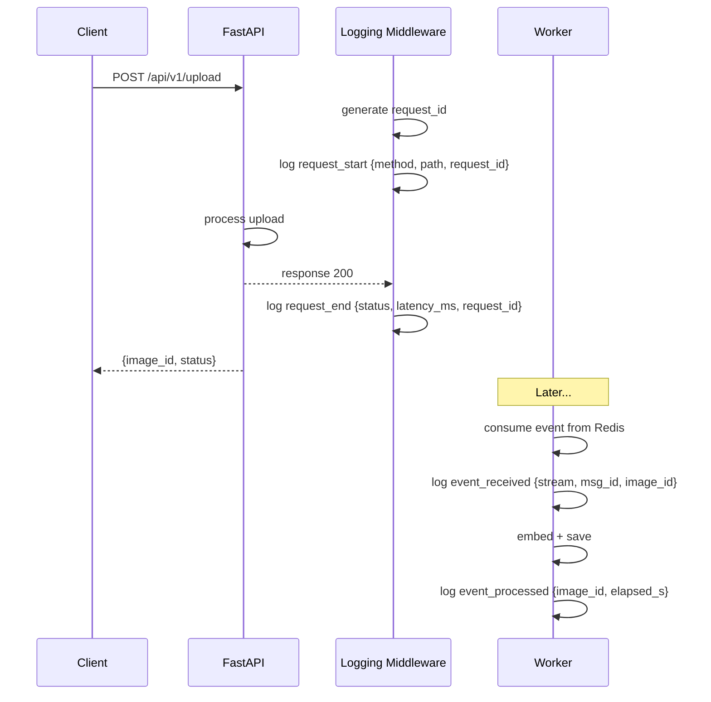

# Spec: Comprehensive Request & Worker Logging

> Specification for logging every request/response in the API server and every event consumed by the worker, with request ID propagation for end-to-end tracing.

---

## Metadata

| Field        | Value                        |
|-------------|------------------------------|
| **ID**      | IS-013                       |
| **Title**   | Request & Worker Logging     |
| **Phase**   | 6 — Observability            |
| **Status**  | Draft                        |
| **Depends** | IS-010, IS-012               |

---

## 1. Objective

Log every HTTP request/response in the API server and every Redis event consumed by the worker with structured context. Propagate a `request_id` across the entire chain so a single upload can be traced from API → Redis → Worker → PostgreSQL.

---

## 2. Architecture



---

## 3. Detailed Design

### 3.1 FastAPI Logging Middleware

**File:** `src/image_search/adapters/input/logging_middleware.py`

```python
import time
import uuid

from starlette.middleware.base import BaseHTTPMiddleware
from starlette.requests import Request
from starlette.responses import Response
import structlog

logger = structlog.get_logger()


class LoggingMiddleware(BaseHTTPMiddleware):
    async def dispatch(self, request: Request, call_next) -> Response:
        request_id = request.headers.get("X-Request-ID", str(uuid.uuid4()))
        structlog.contextvars.bind_contextvars(request_id=request_id)

        logger.info(
            "request_start",
            method=request.method,
            path=str(request.url.path),
            query=str(request.url.query),
            client=request.client.host if request.client else None,
        )

        start = time.time()
        try:
            response = await call_next(request)
        except Exception:
            logger.exception("request_error", method=request.method, path=str(request.url.path))
            raise

        elapsed_ms = round((time.time() - start) * 1000, 1)
        logger.info(
            "request_end",
            method=request.method,
            path=str(request.url.path),
            status=response.status_code,
            latency_ms=elapsed_ms,
        )

        response.headers["X-Request-ID"] = request_id
        structlog.contextvars.unbind_contextvars("request_id")
        return response
```

**Register in `app.py`:**

```python
from image_search.adapters.input.logging_middleware import LoggingMiddleware
app.add_middleware(LoggingMiddleware)
```

### 3.2 Worker Event Logging

**File:** `src/image_search/adapters/input/ingest_worker.py`

Add logging around event consumption:

```python
async def handle_event(payload: dict[str, object]) -> None:
    event = ImageUploadedEvent(**payload)
    structlog.contextvars.bind_contextvars(image_id=event.image_id)
    logger.info("event_received", stream="image:uploaded", image_id=event.image_id, user_id=event.user_id)
    
    try:
        # ... existing processing ...
        logger.info("event_processed", image_id=event.image_id)
    finally:
        structlog.contextvars.unbind_contextvars("image_id")
```

### 3.3 Search Approach Logging

**File:** `src/image_search/adapters/input/search_router.py`

Log which approach was selected and search latency:

```python
logger.info("search_started", query=body.query[:80], approach=approach, top_k=body.top_k)
# ... execute search ...
logger.info("search_completed", approach=approach, results=len(results), latency_ms=round(elapsed*1000, 1))
```

### 3.4 Context Variables

Use `structlog.contextvars` to propagate context across async calls:

| Variable | Set in | Used in |
|----------|--------|---------|
| `request_id` | Logging middleware | All API logs |
| `image_id` | Worker event handler | All worker logs |

### 3.5 Log Levels

| Level | When |
|-------|------|
| `DEBUG` | Embedding vector samples, image dimensions, internal state |
| `INFO` | Request/response, event processed, caption generated |
| `WARNING` | Caption failed (non-fatal), retryable errors |
| `ERROR` | Unhandled exceptions, DB connection failures |

---

## 4. Log Output Examples

### API — Upload request (text format)
```
2026-06-10T16:50:00Z [info] request_start [request_id=abc-123] method=POST path=/api/v1/upload client=127.0.0.1
2026-06-10T16:50:01Z [info] image_uploaded [request_id=abc-123] image_id=uuid-456 user_id=test object=uuid-456.jpg
2026-06-10T16:50:01Z [info] request_end [request_id=abc-123] method=POST path=/api/v1/upload status=200 latency_ms=850.3
```

### API — Search request
```
2026-06-10T16:51:00Z [info] request_start [request_id=def-789] method=POST path=/api/v1/image-search
2026-06-10T16:51:00Z [info] search_started [request_id=def-789] query="a red car" approach=1 top_k=10
2026-06-10T16:51:00Z [info] text_embedded [request_id=def-789] text_preview="a red car" dim=1024
2026-06-10T16:51:00Z [info] search_completed [request_id=def-789] approach=1 results=5 latency_ms=45.2
2026-06-10T16:51:00Z [info] request_end [request_id=def-789] method=POST path=/api/v1/image-search status=200 latency_ms=52.1
```

### Worker — Event processing
```
2026-06-10T16:50:02Z [info] event_received [image_id=uuid-456] stream=image:uploaded user_id=test
2026-06-10T16:50:02Z [info] ingest_started [image_id=uuid-456]
2026-06-10T16:50:02Z [debug] loading_image_from_url [image_id=uuid-456] url=http://minio:9000/images/uuid-456.jpg
2026-06-10T16:50:03Z [debug] image_loaded [image_id=uuid-456] source=url size=1920x1080 bytes=245760
2026-06-10T16:50:04Z [debug] image_embedded [image_id=uuid-456] dim=1024 sample=[0.0123, -0.0456, ...]
2026-06-10T16:50:04Z [info] step1_embed_image [image_id=uuid-456] dim=1024 elapsed_s=1.85
2026-06-10T16:50:04Z [info] step2_saved_to_db [image_id=uuid-456] elapsed_s=0.03
2026-06-10T16:50:06Z [info] caption_started [image_id=uuid-456] image_size=1920x1080 prompt="Describe this image in one sentence."
2026-06-10T16:50:08Z [info] caption_completed [image_id=uuid-456] caption="A red car parked in front of a building" elapsed_s=2.1
2026-06-10T16:50:09Z [info] step3_caption_done [image_id=uuid-456] caption="A red car..." caption_embedding_dim=1024 elapsed_s=4.5
2026-06-10T16:50:09Z [info] ingest_completed [image_id=uuid-456]
2026-06-10T16:50:09Z [info] event_processed [image_id=uuid-456]
```

---

## 5. Acceptance Criteria

- [ ] LoggingMiddleware logs every request (method, path, status, latency_ms)
- [ ] X-Request-ID header is generated if not provided, returned in response
- [ ] request_id appears in all API log lines via structlog context
- [ ] Worker logs event_received and event_processed for every event
- [ ] image_id appears in all worker log lines via structlog context
- [ ] Search logs show approach, query preview, result count, latency
- [ ] DEBUG level shows embedding vector samples and image dimensions
- [ ] Log format switches between JSON (production) and text (dev) via env var

---

## 6. Testing Strategy

- Test middleware generates request_id when header missing
- Test middleware uses provided X-Request-ID header
- Test middleware returns X-Request-ID in response
- Test middleware logs request_start and request_end
- Test middleware logs exceptions as request_error
