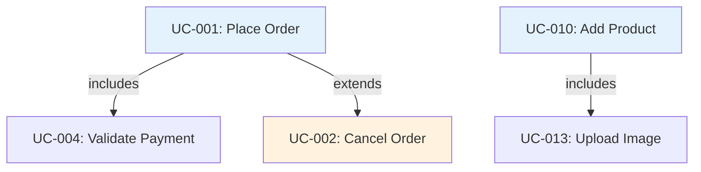

# Use Case Catalog — [Tên Project]

> Tài liệu tổng hợp tất cả use cases của hệ thống. Mỗi use case chi tiết xem tại file riêng.

---

## Hệ thống: [Tên hệ thống]

### Actors

| Actor             | Mô tả                              |
| ----------------- | ----------------------------------- |
| **Customer**      | Người mua hàng                      |
| **Admin**         | Quản trị hệ thống                   |
| **Guest**         | Người dùng chưa đăng nhập           |

---

## Use Cases

### Module: [Tên module, ví dụ: Order]

| ID      | Use Case           | Actor      | Brief Description                                                      | Priority | Status  | Detail                                    |
| ------- | ------------------ | ---------- | ---------------------------------------------------------------------- | -------- | ------- | ----------------------------------------- |
| UC-001  | Place Order        | Customer   | As a customer, I want to place an order so that I can buy products     | High     | Draft   | [link](./use-cases/uc-001-place-order.md) |
| UC-002  | Cancel Order       | Customer   | As a customer, I want to cancel an order so that I can change my mind  | Medium   | Draft   | [link](./use-cases/uc-002-cancel-order.md)|
| UC-003  | View Order History | Customer   | As a customer, I want to view my order history so that I can track purchases | Medium | Draft | [link](./use-cases/uc-003-order-history.md)|

### Module: [Tên module, ví dụ: Product]

| ID      | Use Case           | Actor      | Brief Description                                                      | Priority | Status  | Detail                                    |
| ------- | ------------------ | ---------- | ---------------------------------------------------------------------- | -------- | ------- | ----------------------------------------- |
| UC-010  | Add Product        | Admin      | As an admin, I want to add a product so that customers can purchase it | High     | Draft   | [link](./use-cases/uc-010-add-product.md) |
| UC-011  | Edit Product       | Admin      | As an admin, I want to edit a product so that I can update info        | Medium   | Draft   | [link](./use-cases/uc-011-edit-product.md)|
| UC-012  | Search Products    | Guest      | As a guest, I want to search products so that I can find what I need   | High     | Draft   | [link](./use-cases/uc-012-search-products.md)|

### Module: [Tên module]

| ID      | Use Case           | Actor      | Brief Description                                                      | Priority | Status  | Detail                                    |
| ------- | ------------------ | ---------- | ---------------------------------------------------------------------- | -------- | ------- | ----------------------------------------- |
| UC-XXX  | [Use Case Name]    | [Actor]    | As a [actor], I want to [goal], so that [benefit]                      | [P]      | [S]     | [link]                                    |

---

## Use Case Relationships

- **includes**: Use case B luôn được thực hiện trong use case A
- **extends**: Use case B chỉ thực hiện trong điều kiện cụ thể của A

---

## Notes

- **Priority**: High / Medium / Low
- **Status**: Draft / In Review / Approved / Done
- File chi tiết từng use case đặt trong thư mục `use-cases/`, đặt tên theo convention: `uc-XXX-ten-usecase.md`
