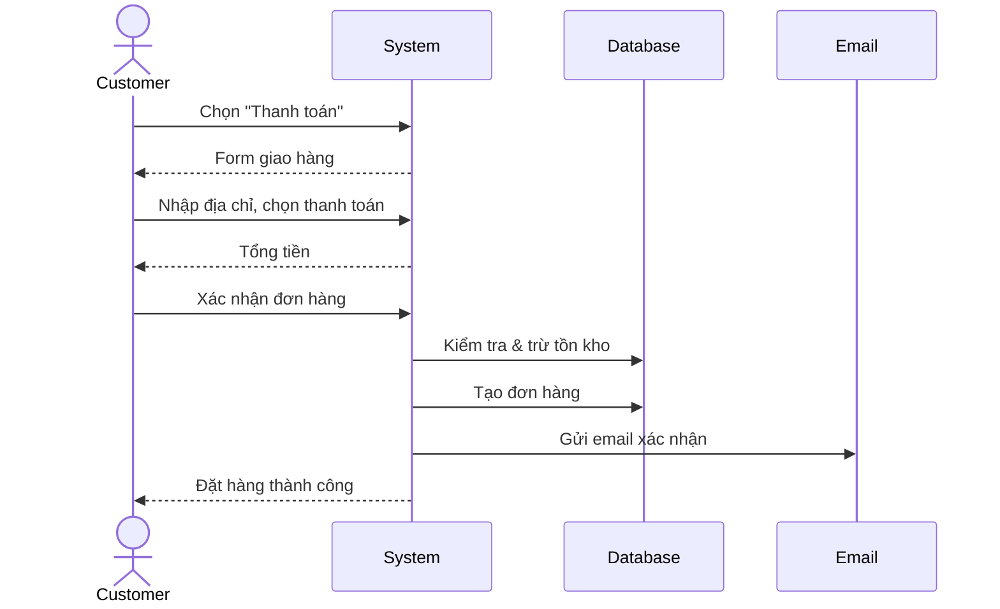
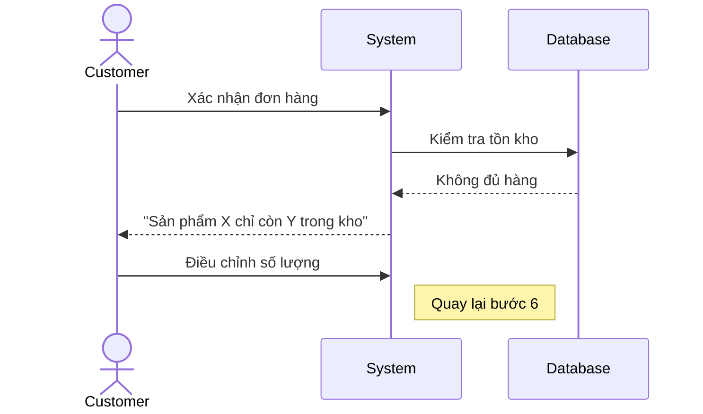
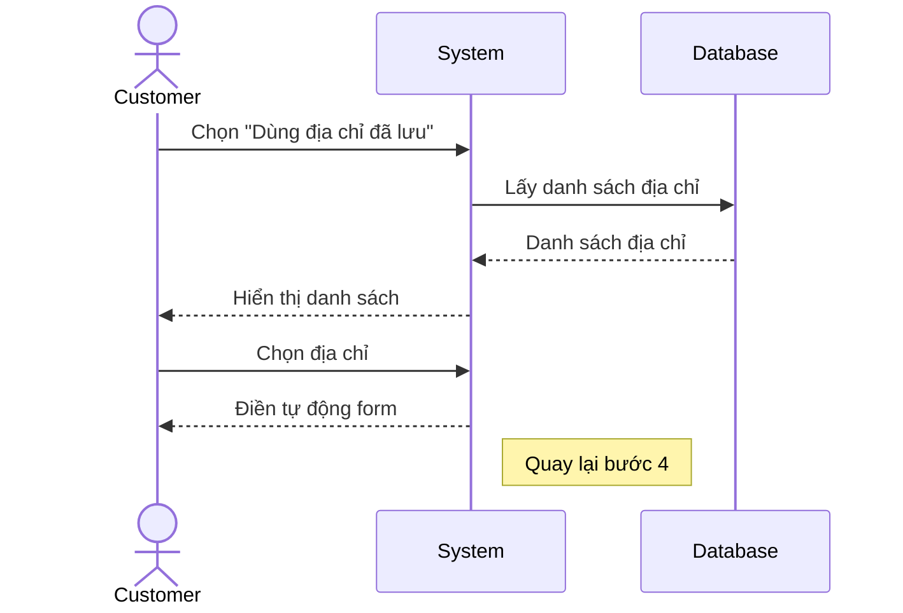
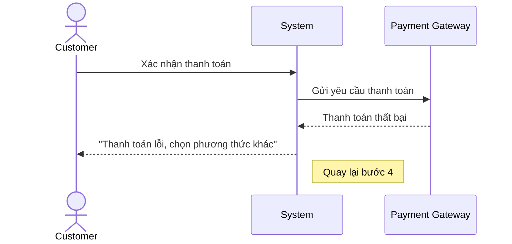
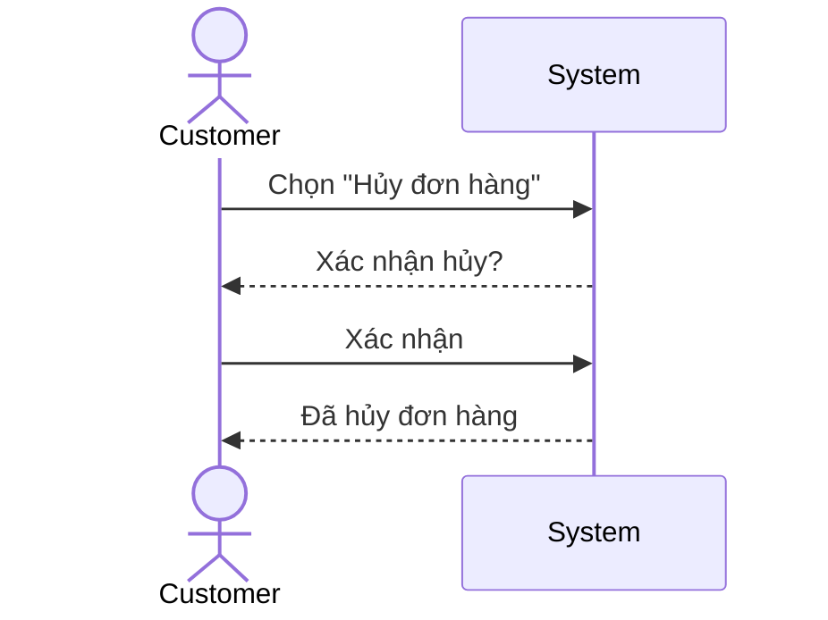

# Use Case: [Tên Use Case]

> Use Case Specification — mô tả cách actor tương tác với hệ thống.

---

## Metadata

| Trường     | Giá trị     |
| ---------- | ----------- |
| **ID**     | UC-XXX      |
| **Tên**    | [Tên]       |
| **Actor**  | [Ai]        |
| **Scope**  | [Hệ thống]  |
| **Status** | Draft / Approved |

---

## 1. Brief Description

**As a** [actor], **I want to** [goal], **so that** [benefit].

> Ví dụ: As a **customer**, I want to **place an order online**, so that **I can
> purchase products without visiting the store**.

---

## 2. Preconditions

- Người dùng đã đăng nhập
- Giỏ hàng có ít nhất 1 sản phẩm

---

## 3. Basic Path ( Main Success Scenario )

1. Khách hàng chọn "Thanh toán" từ giỏ hàng
2. Hệ thống hiển thị form thông tin giao hàng
3. Khách hàng nhập địa chỉ giao hàng
4. Khách hàng chọn phương thức thanh toán
5. Hệ thống hiển thị tổng tiền (bao gồm phí ship)
6. Khách hàng xác nhận đơn hàng
7. Hệ thống kiểm tra tồn kho
8. Hệ thống tạo đơn hàng, trừ tồn kho
9. Hệ thống gửi email xác nhận cho khách hàng
10. Hệ thống hiển thị trang "Đặt hàng thành công"

---

## 4. Extensions ( Alternative Flows )

4a. **Sản phẩm hết hàng** (tại bước 7): Hệ thống thông báo số lượng còn lại. Khách hàng điều chỉnh số lượng. Quay lại bước 6.

4b. **Khách hàng dùng địa chỉ đã lưu** (tại bước 3): Khách hàng chọn từ danh sách địa chỉ đã lưu. Điền tự động vào form. Quay lại bước 4.

4c. **Thanh toán thất bại** (tại bước 6): Hệ thống thông báo lỗi thanh toán. Khách hàng chọn phương thức khác. Quay lại bước 4.

4d. **Khách hàng hủy đơn** (bất kỳ lúc nào): Khách hàng chọn "Hủy". Hệ thống xác nhận hủy. Use case kết thúc.

---

## 5. Postconditions

- Đơn hàng đã được tạo với status "pending"
- Tồn kho đã được cập nhật
- Email xác nhận đã được gửi

---

## 6. Business Rules

- BR1: Mỗi đơn hàng tối đa 50 sản phẩm
- BR2: Đơn hàng trên 500.000đ được miễn phí ship
- BR3: Khách hàng chỉ có tối đa 5 đơn "pending" cùng lúc

---

## 7. Special Requirements ( Optional )

- Thời gian xử lý < 3 giây
- Hỗ trợ tiếng Việt và tiếng Anh
- Responsive trên mobile

---

## 8. Data Requirements ( Optional )

| Data     | Source             | Notes                  |
| -------- | ------------------ | ---------------------- |
| Giỏ hàng | Session / Database | Phải có >= 1 sản phẩm |
| Địa chỉ  | User profile       | Nhập mới hoặc chọn đã lưu |
| Tồn kho  | Product database   | Cập nhật realtime      |
