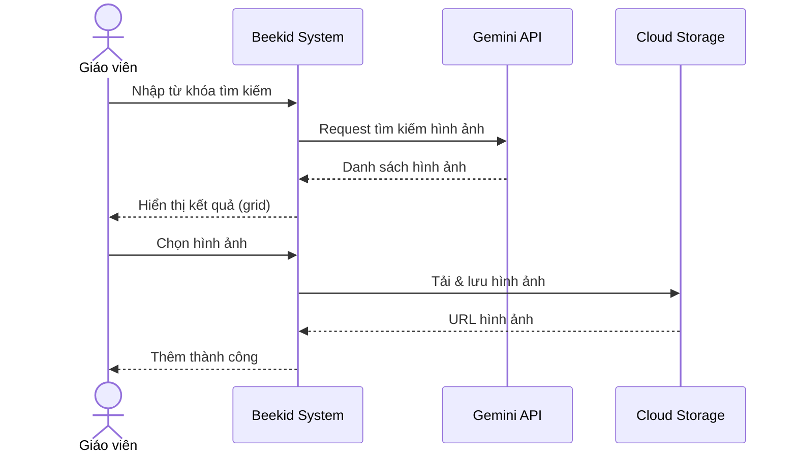
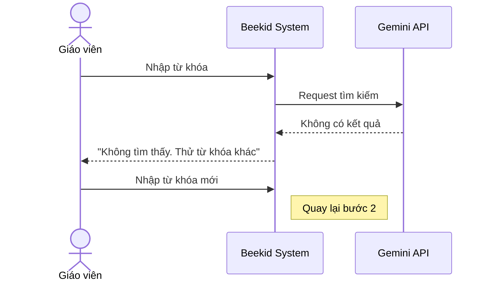

# Use Case: Tìm kiếm hình ảnh từ Gemini

> Giáo viên tìm kiếm hình ảnh từ Gemini API và đưa vào Kho hoặc bài học.

---

## Metadata

| Trường     | Giá trị     |
| ---------- | ----------- |
| **ID**     | UC-001      |
| **Tên**    | Gemini Image Search |
| **Actor**  | Giáo viên   |
| **Scope**  | Beekid AI Platform |
| **Status** | Draft       |

---

## 1. Brief Description

**As a** giáo viên, **I want to** tìm kiếm hình ảnh từ Gemini API, **so that** tôi có thể sử dụng hình ảnh chất lượng cao trong Kho và bài học mà không cần rời khỏi Beekid.

---

## 2. Preconditions

- Giáo viên đã đăng nhập
- Có kết nối internet
- Gemini API key đã được cấu hình

---

## 3. Basic Path ( Main Success Scenario )

1. Giáo viên vào phần nhập liệu bài học hoặc Kho hình ảnh
2. Giáo viên nhập từ khóa tìm kiếm hình ảnh
3. Hệ thống gửi request tìm kiếm đến Gemini API
4. Gemini trả về danh sách hình ảnh liên quan
5. Hệ thống hiển thị kết quả tìm kiếm (grid view)
6. Giáo viên chọn hình ảnh mong muốn
7. Hệ thống tải hình ảnh và lưu vào Cloud Storage
8. Hệ thống thêm hình ảnh vào Kho hoặc bài học
9. Hệ thống hiển thị thông báo "Thêm hình ảnh thành công"

---

## 4. Extensions ( Alternative Flows )

4a. **Gemini không tìm thấy kết quả** (tại bước 4): Hệ thống hiển thị "Không tìm thấy hình ảnh. Thử từ khóa khác." Giáo viên nhập lại từ khóa. Quay lại bước 2.

4b. **Giáo viên muốn tìm kiếm lại** (tại bước 5): Giáo viên thay đổi từ khóa. Quay lại bước 2.

4c. **Hình ảnh quá lớn** (tại bước 7): Hệ thống tự động resize/nén hình ảnh trước khi lưu. Quay lại bước 8.

---

## 5. Postconditions

- Hình ảnh đã được lưu vào Cloud Storage
- Hình ảnh đã được thêm vào Kho hoặc bài học
- Metadata hình ảnh đã được lưu vào database

---

## 6. Business Rules

- BR1: Mỗi lần tìm kiếm hiển thị tối đa 20 kết quả
- BR2: Hình ảnh phải phù hợp với nội dung giáo dục trẻ em
- BR3: Kích thước file upload tối đa 10MB
- BR4: Hình ảnh được filter nội dung trước khi hiển thị

---

## 7. Special Requirements ( Optional )

- Thời gian tìm kiếm < 3 giây
- Hình ảnh phải có chất lượng tối thiểu 300x300px
- Hỗ trợ tìm kiếm bằng tiếng Việt và tiếng Anh
- Content filter loại bỏ hình ảnh không phù hợp trẻ em

---

## 8. Data Requirements ( Optional )

| Data          | Source             | Notes                           |
| ------------- | ------------------ | ------------------------------- |
| Từ khóa       | Giáo viên nhập     | String, tối đa 200 ký tự       |
| Hình ảnh      | Gemini API         | URL hoặc base64                |
| Metadata      | Gemini API         | Tên, mô tả, tags               |
| Cloud Storage | Google Cloud       | Lưu trữ hình ảnh vĩnh viễn     |
