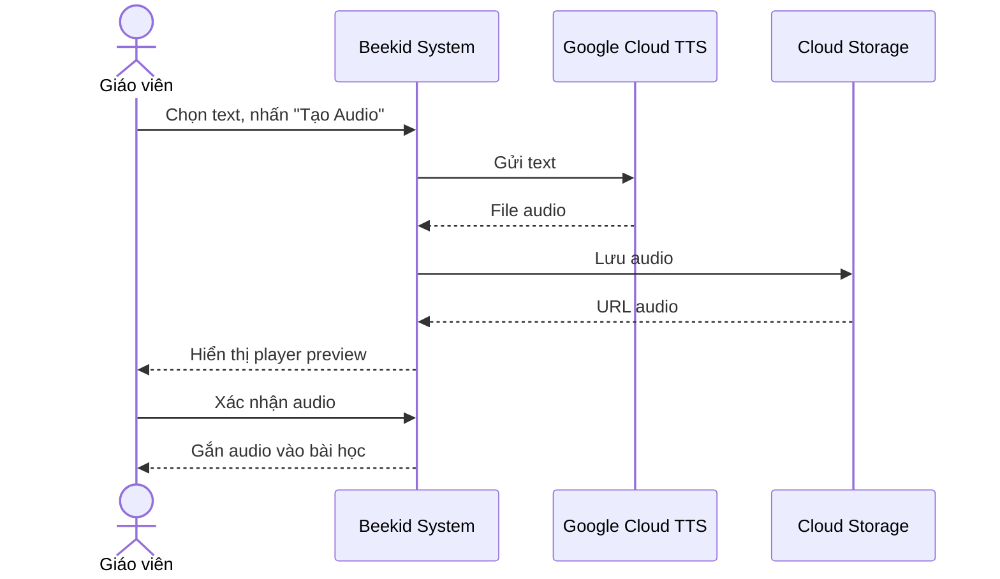
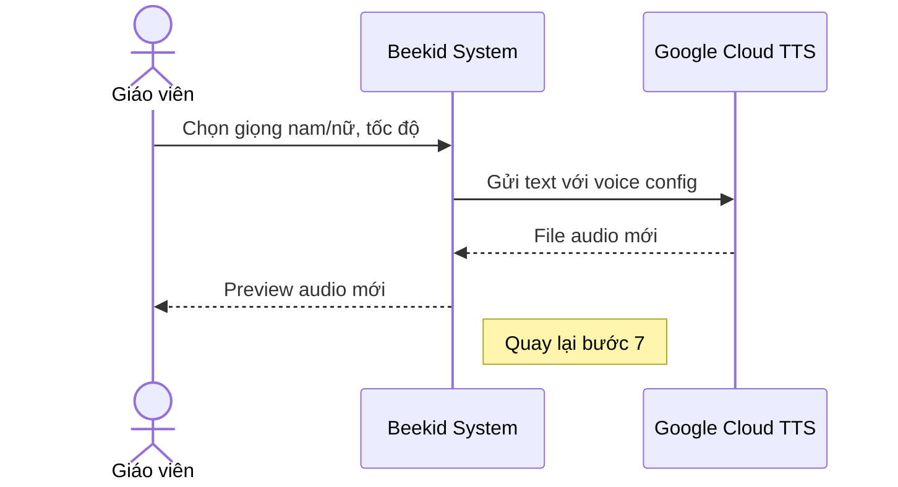

# Use Case: Text-to-Speech

> Giáo viên tạo audio từ text nội dung bài học bằng Google Cloud TTS.

---

## Metadata

| Trường     | Giá trị     |
| ---------- | ----------- |
| **ID**     | UC-002      |
| **Tên**    | Text-to-Speech |
| **Actor**  | Giáo viên   |
| **Scope**  | Beekid AI Platform |
| **Status** | Draft       |

---

## 1. Brief Description

**As a** giáo viên, **I want to** chuyển đổi text thành audio, **so that** học sinh có thể nghe nội dung bài học mà không cần đọc.

---

## 2. Preconditions

- Giáo viên đã đăng nhập
- Có nội dung text cần chuyển đổi
- Google Cloud TTS đã được cấu hình

---

## 3. Basic Path ( Main Success Scenario )

1. Giáo viên chọn text trong phần nhập liệu bài học
2. Giáo viên nhấn nút "Tạo Audio"
3. Hệ thống gửi text đến Google Cloud TTS API
4. TTS trả về file audio
5. Hệ thống lưu audio vào Cloud Storage
6. Hệ thống hiển thị player audio để preview
7. Giáo viên nghe và xác nhận audio
8. Hệ thống gắn audio vào bài học

---

## 4. Extensions ( Alternative Flows )

4a. **Giáo viên muốn chọn giọng khác** (tại bước 6): Giáo viên chọn giọng (nam/nữ, tốc độ). Hệ thống tạo lại audio. Quay lại bước 3.

4b. **Text quá dài** (tại bước 3): Hệ thống chia text thành nhiều đoạn nhỏ, tạo audio từng đoạn, ghép lại. Quay lại bước 5.

4c. **Giáo viên muốn thu âm lại** (tại bước 7): Giáo viên chọn "Thu âm thủ công" thay vì TTS. Hệ thống mở recorder. Use case kết thúc (chuyển sang flow thu âm).

---

## 5. Postconditions

- File audio đã được lưu vào Cloud Storage
- Audio đã được gắn vào bài học
- Metadata audio (duration, voice, speed) đã được lưu

---

## 6. Business Rules

- BR1: Text tối đa 5000 ký tự mỗi lần tạo
- BR2: Hỗ trợ giọng tiếng Việt nam/nữ
- BR3: Tốc độ phát có thể điều chỉnh (0.5x - 2x)
- BR4: Audio được lưu ở định dạng MP3

---

## 7. Special Requirements ( Optional )

- Thời gian tạo audio < 5 giây cho 1000 ký tự
- Chất lượng audio: 128kbps MP3
- Hỗ trợ SSML cho pronunciation đặc biệt

---

## 8. Data Requirements ( Optional )

| Data        | Source             | Notes                           |
| ----------- | ------------------ | ------------------------------- |
| Text        | Giáo viên nhập     | String, tối đa 5000 ký tự      |
| Voice config| Giáo viên chọn     | Giới tính, tốc độ              |
| Audio file  | Google Cloud TTS   | MP3 format                      |
| Cloud Storage| Google Cloud      | Lưu trữ audio vĩnh viễn        |
