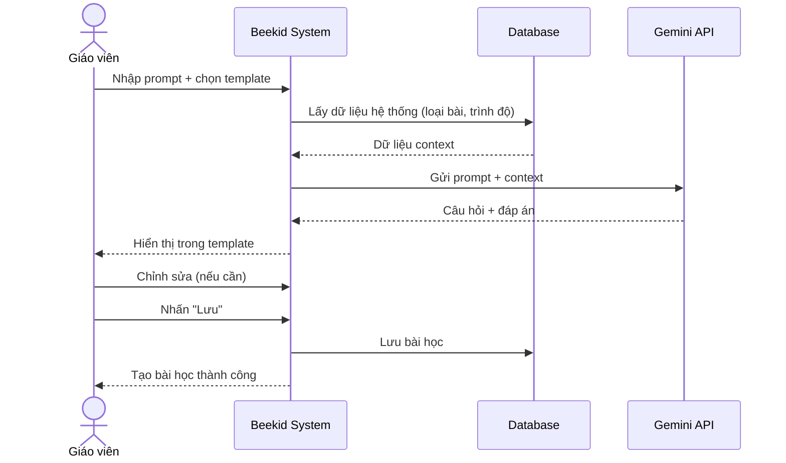
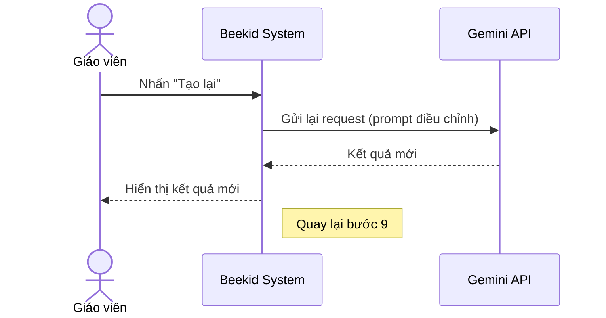

# Use Case: AI Lesson Generator

> Giáo viên nhập prompt → hệ thống kết hợp Gemini API và dữ liệu hệ thống → tạo câu hỏi và đáp án → chọn template → chỉnh sửa.

---

## Metadata

| Trường     | Giá trị     |
| ---------- | ----------- |
| **ID**     | UC-003      |
| **Tên**    | AI Lesson Generator |
| **Actor**  | Giáo viên   |
| **Scope**  | Beekid AI Platform |
| **Status** | Draft       |

---

## 1. Brief Description

**As a** giáo viên, **I want to** nhập prompt và để AI tạo bài học tự động (câu hỏi + đáp án), **so that** tôi tiết kiệm thời gian tạo nội dung và có bài học chất lượng.

---

## 2. Preconditions

- Giáo viên đã đăng nhập
- Có ít nhất 1 template bài học trong hệ thống
- Gemini API đã được cấu hình

---

## 3. Basic Path ( Main Success Scenario )

1. Giáo viên vào trang "Tạo bài học mới"
2. Giáo viên nhập prompt mô tả bài học (ví dụ: "Tạo 10 câu hỏi toán lớp 3 về phân số")
3. Giáo viên chọn template bài học từ danh sách templates có sẵn
4. Giáo viên nhấn "Tạo bài học"
5. Hệ thống kết hợp prompt + dữ liệu hệ thống (loại bài, trình độ, template)
6. Hệ thống gửi request đến Gemini API
7. Gemini trả về danh sách câu hỏi và đáp án
8. Hệ thống hiển thị kết quả trong template đã chọn
9. Giáo viên chỉnh sửa câu hỏi, đáp án nếu cần
10. Giáo viên nhấn "Lưu bài học"
11. Hệ thống lưu bài học vào database

---

## 4. Extensions ( Alternative Flows )

4a. **Gemini trả về kết quả không phù hợp** (tại bước 7): Giáo viên nhấn "Tạo lại". Hệ thống gửi lại request với prompt điều chỉnh. Quay lại bước 6.

4b. **Giáo viên muốn thay đổi template** (tại bước 8): Giáo viên chọn template khác. Hệ thống render lại kết quả trong template mới. Quay lại bước 9.

4c. **Gemini API lỗi** (tại bước 6): Hệ thống hiển thị "Không thể tạo bài học. Thử lại sau." Giáo viên có thể nhập thủ công. Use case kết thúc.

4d. **Giáo viên muốn thêm hình ảnh** (tại bước 9): Giáo viên sử dụng UC-001 (Gemini Image Search) để tìm và thêm hình ảnh. Quay lại bước 9.

---

## 5. Postconditions

- Bài học đã được lưu vào database
- Câu hỏi và đáp án đã được lưu
- Template đã được áp dụng
- Hình ảnh (nếu có) đã được liên kết

---

## 6. Business Rules

- BR1: Mỗi prompt tạo tối đa 20 câu hỏi
- BR2: Câu hỏi phải phù hợp với trình độ đã chọn
- BR3: Đáp án phải có ít nhất 1 đáp án đúng
- BR4: Bài học draft tự động lưu mỗi 30 giây

---

## 7. Special Requirements ( Optional )

- Thời gian tạo bài học < 10 giây
- Hỗ trợ prompt bằng tiếng Việt
- Giáo viên có thể chọn số lượng câu hỏi
- Có preview template trước khi lưu

---

## 8. Data Requirements ( Optional )

| Data          | Source             | Notes                           |
| ------------- | ------------------ | ------------------------------- |
| Prompt        | Giáo viên nhập     | String, mô tả bài học          |
| Template      | Hệ thống           | Danh sách templates có sẵn     |
| Context data  | Database           | Loại bài, trình độ, môn học    |
| Câu hỏi       | Gemini API         | Generated content              |
| Đáp án        | Gemini API         | Multiple choice hoặc tự luận   |
