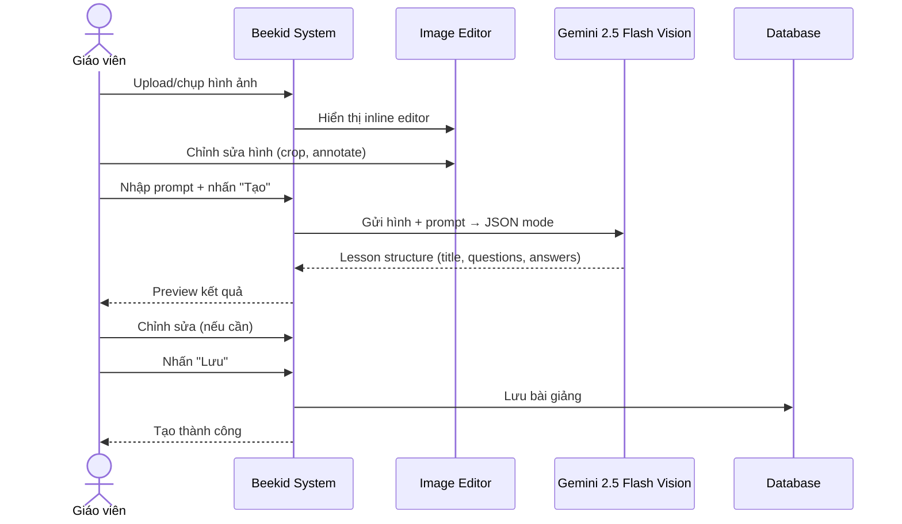
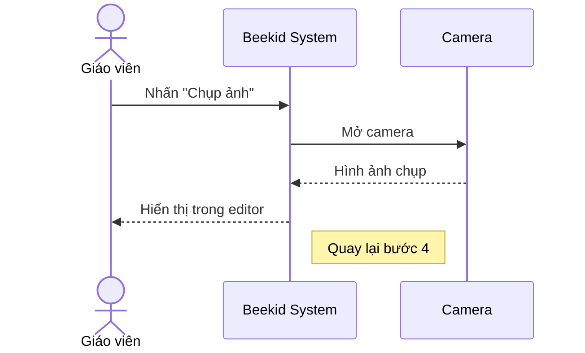
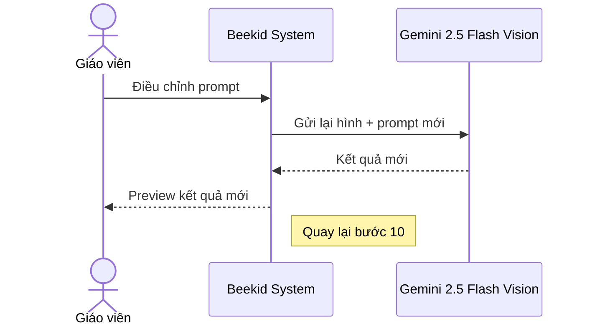

# Use Case: Interactive Lesson (Gemini 2.5 Flash Vision)

> ⚠️ **Lưu ý:** Use case này ban đầu dùng **Google DeepMind Genie 3** (world model). Genie đã bị reject vì:
> - Không có public REST API — chỉ dùng qua Project Genie web UI
> - Giá $249.99/tháng/user — không scale được
> - Giới hạn 18+ — không phù hợp nền tảng trẻ em
> - Là world model tạo 3D environment — không thể gen lesson content
>
> **Thay thế bằng: Gemini 2.5 Flash Vision** — có REST API, hỗ trợ image input, pay-per-token, giá ~$0.30/1M tokens.
>
> Xem phân tích chi tiết tại [5.4](../proposals/proposal-beekid-ai-features.md#54-genie-model-analysis-blocker).

---

## Metadata

| Trường     | Giá trị     |
| ---------- | ----------- |
| **ID**     | UC-004      |
| **Tên**    | Interactive Lesson |
| **Actor**  | Giáo viên   |
| **Scope**  | Beekid AI Platform |
| **Status** | Draft       |

---

## 1. Brief Description

**As a** giáo viên, **I want to** upload hình ảnh + nhập prompt để **Gemini 2.5 Flash Vision** tạo bài giảng tương tác (câu hỏi + đáp án + giải thích), **so that** tôi có bài giảng sinh động thay vì video/slide truyền thống.

---

## 2. Preconditions

- Giáo viên đã đăng nhập
- Gemini API đã được cấu hình trên Vertex AI / Google AI
- Có kết nối internet

---

## 3. Basic Path ( Main Success Scenario )

1. Giáo viên vào trang "Tạo bài giảng tương tác"
2. Giáo viên upload hình ảnh hoặc chụp từ điện thoại
3. Hệ thống hiển thị hình ảnh trong inline editor
4. Giáo viên chỉnh sửa hình ảnh (crop, annotate) nếu cần
5. Giáo viên nhập prompt mô tả bài giảng mong muốn
6. Giáo viên nhấn "Tạo bài giảng"
7. Hệ thống gửi hình ảnh + prompt đến **Gemini 2.5 Flash Vision API**
8. Gemini phân tích hình ảnh, gen lesson structure (JSON mode): title, questions[], answers[], explanation
9. Hệ thống hiển thị kết quả để giáo viên preview
10. Giáo viên chỉnh sửa kết quả nếu cần
11. Giáo viên nhấn "Lưu bài giảng"
12. Hệ thống lưu bài giảng vào database

---

## 4. Extensions ( Alternative Flows )

4a. **Giáo viên chụp ảnh từ điện thoại** (tại bước 2): Giáo viên chọn "Chụp ảnh" thay vì upload. Hệ thống mở camera. Quay lại bước 3.

4b. **Gemini trả về kết quả không đúng** (tại bước 8): Giáo viên điều chỉnh prompt và tạo lại. Quay lại bước 5.

4c. **Hình ảnh quá lớn** (tại bước 2): Hệ thống tự động nén hình ảnh trước khi upload. Quay lại bước 3.

4d. **Gemini API timeout** (tại bước 7): Hệ thống hiển thị "Đang xử lý, vui lòng đợi..." và retry tự động. Nếu timeout lần 2, hiển thị lỗi.

---

## 5. Postconditions

- Bài giảng đã được lưu vào database
- Hình ảnh đã được lưu vào Cloud Storage
- Prompt và kết quả đã được log

---

## 6. Business Rules

- BR1: Hình ảnh tối đa 20MB (Gemini hỗ trợ JPEG, PNG, WebP, HEIC)
- BR2: Prompt tối đa 2000 ký tự
- BR3: Bài giảng phải được review trước khi publish cho HS
- BR4: Mỗi GV tạo tối đa 50 bài giảng tương tác/tháng

---

## 7. Special Requirements ( Optional )

- Inline editor hoạt động trên mobile
- Thời gian Gemini xử lý < 30 giây
- Hỗ trợ upload nhiều hình ảnh cho 1 bài giảng
- Preview realtime khi chỉnh sửa

---

## 8. Data Requirements ( Optional )

| Data          | Source             | Notes                           |
| ------------- | ------------------ | ------------------------------- |
| Hình ảnh      | Upload / Camera    | JPG, PNG, tối đa 20MB          |
| Prompt        | Giáo viên nhập     | String, tối đa 2000 ký tự      |
| Gemini result | Gemini 2.5 Flash   | JSON: title, questions, answers |
| Editor state  | Client-side        | Crop, annotate data            |
