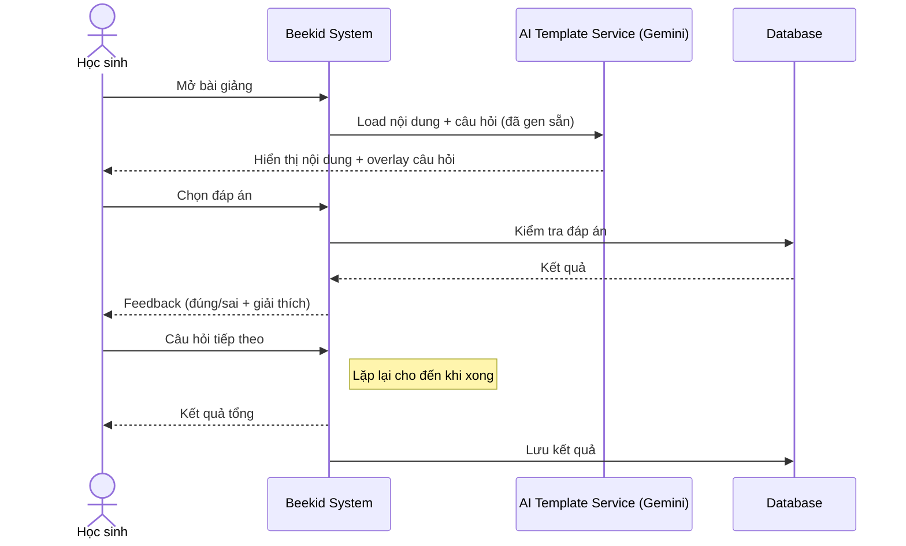
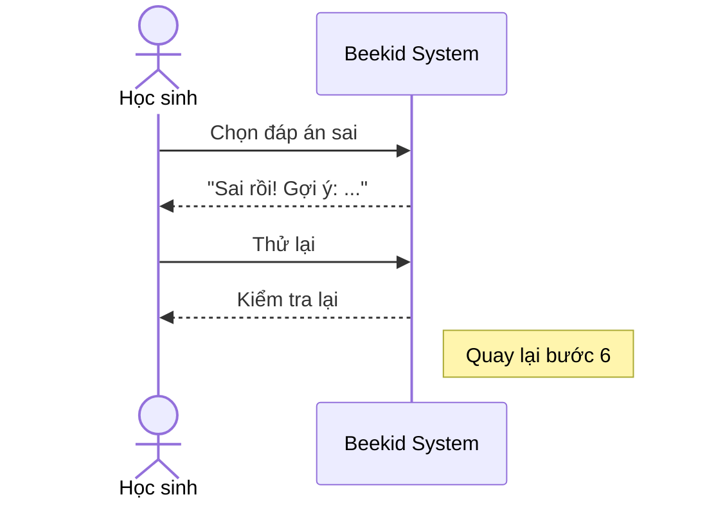

# Use Case: Interactive Template Overlay (Gemini + Frontend)

> ⚠️ **Lưu ý:** Use case này ban đầu dùng **Google DeepMind Genie 3** (world model) để gen template UI. Genie đã bị reject vì:
> - Là world model tạo 3D environment — không thể gen template UI/overlay
> - Không có public REST API — chỉ dùng qua Project Genie web UI
> - Giá $249.99/tháng/user — không scale được
>
> **Giải pháp thay thế:** Dùng **Gemini 2.5 Flash (text)** gen nội dung câu hỏi + đáp án + giải thích → frontend (React/Next.js) render overlay UI. Đây là bài toán frontend rendering, không cần AI gen UI.
>
> Xem phân tích chi tiết tại [5.4](../proposals/proposal-beekid-ai-features.md#54-genie-model-analysis-blocker).

---

## Metadata

| Trường     | Giá trị     |
| ---------- | ----------- |
| **ID**     | UC-005      |
| **Tên**    | Interactive Template Overlay |
| **Actor**  | Học sinh    |
| **Scope**  | Beekid AI Platform |
| **Status** | Draft       |

---

## 1. Brief Description

**As a** học sinh, **I want to** tương tác với bài giảng thông qua các lớp câu hỏi giáo dục (overlay) do AI tạo, **so that** tôi học tập hiệu quả qua trải nghiệm tương tác mà không cần rời khỏi nội dung chính.

Kiến trúc: Gemini 2.5 Flash gen nội dung (JSON: câu hỏi, đáp án, giải thích) → hệ thống lưu vào PostgreSQL → frontend render overlay UI với các câu hỏi.

---

## 2. Preconditions

- Học sinh đã đăng nhập
- Giáo viên đã tạo bài giảng tương tác (UC-004)
- Bài giảng đã được publish và có dữ liệu câu hỏi overlay

---

## 3. Basic Path ( Main Success Scenario )

1. Học sinh mở bài giảng từ danh sách bài học
2. Hệ thống hiển thị nội dung bài giảng (hình ảnh, text)
3. Hệ thống phủ lên lớp overlay với câu hỏi giáo dục (lấy từ database, do Gemini gen)
4. Học sinh đọc câu hỏi và chọn đáp án
5. Hệ thống kiểm tra đáp án
6. Hệ thống hiển thị feedback (đúng/sai + giải thích)
7. Học sinh chuyển sang câu hỏi tiếp theo
8. Lặp lại bước 3-7 cho đến khi hoàn thành
9. Hệ thống hiển thị kết quả tổng (điểm, thời gian)
10. Hệ thống lưu kết quả vào database

---

## 4. Extensions ( Alternative Flows )

4a. **Học sinh trả lời sai** (tại bước 5): Hệ thống hiển thị giải thích chi tiết + gợi ý. Học sinh có thể thử lại. Quay lại bước 4.

4b. **Học sinh muốn xem lại nội dung** (tại bước 4): Học sinh đóng overlay tạm thời để xem nội dung chính. Mở lại overlay. Quay lại bước 3.

4c. **Bài giảng có nhiều phần** (tại bước 8): Hệ thống tự động chuyển sang phần tiếp theo khi hoàn thành phần hiện tại.

---

## 5. Postconditions

- Kết quả học tập đã được lưu (điểm, thời gian, số câu đúng)
- Progress đã được cập nhật
- Giáo viên có thể xem kết quả của học sinh

---

## 6. Business Rules

- BR1: Mỗi câu hỏi có thời gian trả lời tối đa 60 giây
- BR2: Học sinh phải trả lời đúng ≥ 70% để qua phần tiếp theo
- BR3: Overlay không che quá 50% nội dung chính
- BR4: Câu hỏi phải phù hợp với độ tuổi và trình độ

---

## 7. Special Requirements ( Optional )

- Overlay có thể kéo, resize để không che nội dung quan trọng
- Hỗ trợ touch interaction trên mobile/tablet
- Animation mượt, không giật khi overlay xuất hiện
- Hỗ trợ accessibility (font lớn, đọc aloud)

---

## 8. Data Requirements ( Optional )

| Data          | Source             | Notes                           |
| ------------- | ------------------ | ------------------------------- |
| Nội dung bài giảng | Database        | Bài giảng đã tạo từ UC-004     |
| Câu hỏi       | Gemini 2.5 Flash   | Gen từ nội dung bài giảng       |
| Đáp án        | Gemini 2.5 Flash   | Đáp án đúng + giải thích        |
| Kết quả       | Học sinh submit    | Đáp án đã chọn, thời gian       |
