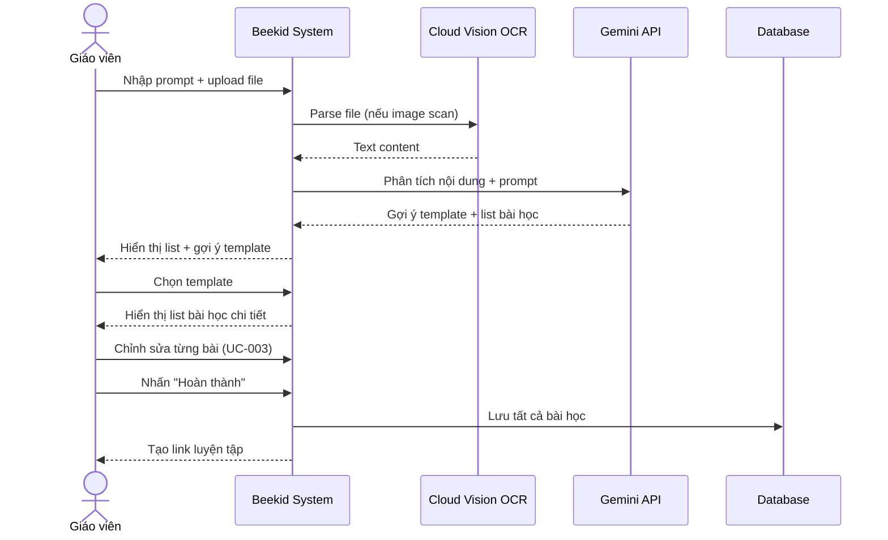
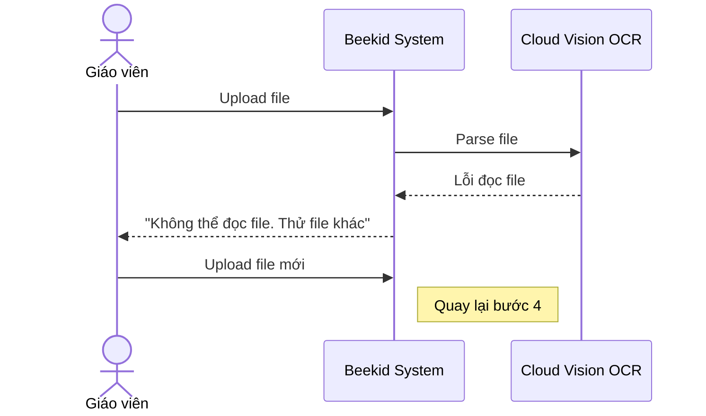

# Use Case: AI Lesson List Generator

> Giáo viên nhập prompt + attach file (PDF/DOC/image scan) → gợi ý template → tạo list bài học → sửa từng bài → tạo link luyện tập.

---

## Metadata

| Trường     | Giá trị     |
| ---------- | ----------- |
| **ID**     | UC-006      |
| **Tên**    | AI Lesson List Generator |
| **Actor**  | Giáo viên   |
| **Scope**  | Beekid AI Platform |
| **Status** | Draft       |

---

## 1. Brief Description

**As a** giáo viên, **I want to** nhập prompt và upload file (PDF/DOC/image scan) để AI tạo danh sách bài học, **so that** tôi tạo được giáo án nhanh chóng từ tài liệu có sẵn.

---

## 2. Preconditions

- Giáo viên đã đăng nhập
- Có file PDF, DOC hoặc image scan
- Gemini API và OCR đã được cấu hình

---

## 3. Basic Path ( Main Success Scenario )

1. Giáo viên vào trang "Tạo giáo án"
2. Giáo viên nhập prompt mô tả yêu cầu
3. Giáo viên upload file (PDF, DOC hoặc image scan)
4. Hệ thống parse file (OCR nếu là image scan)
5. Hệ thống phân tích nội dung file bằng Gemini
6. Hệ thống gợi ý template phù hợp
7. Giáo viên chọn template
8. Hệ thống tạo danh sách bài học dựa trên nội dung file
9. Hệ thống hiển thị list bài học (overview)
10. Giáo viên chọn từng bài học để chỉnh sửa (dùng UC-003 flow)
11. Giáo viên nhấn "Hoàn thành"
12. Hệ thống tạo link luyện tập cho giáo viên và học sinh

---

## 4. Extensions ( Alternative Flows )

4a. **File không đọc được** (tại bước 4): Hệ thống thông báo "Không thể đọc file. Vui lòng thử file khác." Giáo viên upload lại. Quay lại bước 3.

4b. **Giáo viên muốn thêm/xóa bài học** (tại bước 9): Giáo viên thêm bài học mới hoặc xóa bài không cần thiết. Quay lại bước 10.

4c. **Gemini gợi ý template không phù hợp** (tại bước 6): Giáo viên chọn template khác từ danh sách. Quay lại bước 8.

4d. **Giáo viên muốn tạo lại toàn bộ** (tại bước 9): Giáo viên thay đổi prompt và tạo lại. Quay lại bước 2.

---

## 5. Postconditions

- Danh sách bài học đã được lưu vào database
- Link luyện tập đã được tạo
- Giáo viên và học sinh có thể truy cập link

---

## 6. Business Rules

- BR1: File upload tối đa 50MB
- BR2: Hỗ trợ PDF, DOC, DOCX, JPG, PNG
- BR3: Mỗi lần tạo tối đa 30 bài học
- BR4: Link luyện tập có hiệu lực 30 ngày
- BR5: OCR chỉ hỗ trợ tiếng Việt và tiếng Anh

---

## 7. Special Requirements ( Optional )

- Xử lý file lớn (< 50MB) trong vòng 30 giây
- OCR tiếng Việt chính xác ≥ 90%
- Hỗ trợ batch upload nhiều files
- Giáo viên có thể reorder bài học bằng drag & drop

---

## 8. Data Requirements ( Optional )

| Data          | Source             | Notes                           |
| ------------- | ------------------ | ------------------------------- |
| Prompt        | Giáo viên nhập     | String                          |
| File          | Upload             | PDF, DOC, JPG, PNG              |
| Text content  | OCR / File parse   | Extracted text                  |
| Template      | Hệ thống           | Gợi ý từ Gemini                |
| List bài học  | Gemini API         | Generated content               |
| Link luyện tập| Hệ thống           | Generated URL                   |
