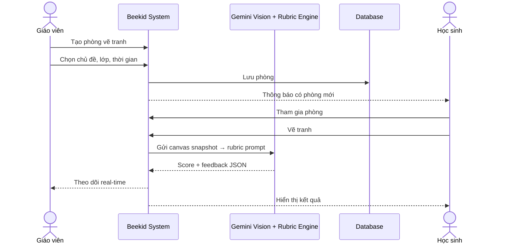

# Use Case: Tạo phòng vẽ tranh (Gemini Vision + Rubric Pipeline)

> ⚠️ **Lưu ý:** Use case này ban đầu dùng **Google DeepMind Genie 3** (world model) để đánh giá hình vẽ. Genie đã bị reject vì không có API đánh giá/scoring. **Thay thế bằng: Gemini Vision + Rubric Pipeline** — gửi canvas snapshot → Gemini Vision phân tích → rubric engine tính điểm.
>
> Xem chi tiết tại [5.4.6](../proposals/proposal-beekid-ai-features.md#546-resolution--model-selection).

---

## Metadata

| Trường     | Giá trị     |
| ---------- | ----------- |
| **ID**     | UC-007      |
| **Tên**    | Drawing Game - Practice Room |
| **Actor**  | Giáo viên   |
| **Scope**  | Beekid AI Platform |
| **Status** | Draft       |

---

## 1. Brief Description

**As a** giáo viên, **I want to** tạo phòng luyện tập vẽ tranh với AI (Gemini Vision + Rubric Pipeline) cho học sinh, **so that** học sinh có thể sáng tạo và luyện tập vẽ trong môi trường được kiểm soát, có đánh giá tự động.

Kiến trúc đánh giá: Canvas snapshot → Gemini Vision API → rubric prompt (sáng tạo, kỹ thuật, phù hợp chủ đề) → structured JSON score → PostgreSQL.

---

## 2. Preconditions

- Giáo viên đã đăng nhập
- Gemini API đã được cấu hình
- Có ít nhất 1 học sinh trong lớp

---

## 3. Basic Path ( Main Success Scenario )

1. Giáo viên vào trang "Quản lý lớp"
2. Giáo viên nhấn "Tạo phòng vẽ tranh"
3. Giáo viên chọn chủ đề vẽ (ví dụ: "Vẽ con vật", "Vẽ phong cảnh")
4. Giáo viên chọn lớp và học sinh tham gia
5. Giáo viên đặt thời gian bắt đầu và kết thúc
6. Giáo viên nhấn "Tạo phòng"
7. Hệ thống tạo phòng luyện tập
8. Hệ thống gửi thông báo cho học sinh
9. Học sinh tham gia phòng và vẽ tranh
10. Giáo viên theo dõi tiến độ vẽ của học sinh real-time
11. Khi hết thời gian, hệ thống đóng phòng
12. Hệ thống hiển thị kết quả và đánh giá của Gemini (điểm rubric + feedback text)

---

## 4. Extensions ( Alternative Flows )

4a. **Học sinh tham gia muộn** (tại bước 9): Học sinh tham gia sau khi phòng đã bắt đầu. Vẫn được vẽ nhưng thời gian còn lại ngắn hơn.

4b. **Giáo viên gia hạn thời gian** (tại bước 11): Giáo viên quyết định gia hạn thêm thời gian. Hệ thống cập nhật. Quay lại bước 9.

4c. **Gemini API lỗi khi đánh giá** (tại bước 12): Hệ thống hiển thị "Đang đánh giá..." và retry. Nếu vẫn lỗi, hiển thị kết quả không có đánh giá AI (giáo viên tự đánh giá).

---

## 5. Postconditions

- Phòng đã được tạo và lưu vào database
- Học sinh đã được thông báo
- Kết quả vẽ và đánh giá đã được lưu

---

## 6. Business Rules

- BR1: Mỗi phòng tối đa 30 học sinh
- BR2: Thời gian vẽ tối thiểu 10 phút, tối đa 60 phút
- BR3: Giáo viên có thể tạo tối đa 10 phòng/ngày
- BR4: Hình vẽ được lưu trong 7 ngày

---

## 7. Special Requirements ( Optional )

- Real-time canvas sync giữa giáo viên và học sinh
- Hỗ trợ vẽ bằng chuột và cảm ứng (mobile/tablet)
- Gemini Vision + Rubric đánh giá dựa trên chủ đề và độ tuổi
- Export hình vẽ thành file PNG

---

## 8. Data Requirements ( Optional )

| Data          | Source             | Notes                           |
| ------------- | ------------------ | ------------------------------- |
| Chủ đề       | Giáo viên chọn     | Predefined + custom            |
| Danh sách HS  | Database           | Lớp học                        |
| Thời gian     | Giáo viên đặt      | Bắt đầu, kết thúc              |
| Hình vẽ       | Canvas (client)    | Canvas snapshot (base64)        |
| Đánh giá      | Gemini Vision + Rubric | JSON: creativity, technique, relevance, total, feedback |
