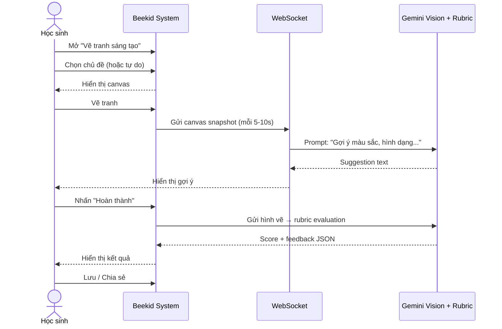

# Use Case: Trẻ tự sáng tạo vẽ tranh (Gemini Vision + WebSocket)

> ⚠️ **Lưu ý:** Use case này ban đầu dùng **Google DeepMind Genie 3** (world model) để gợi ý realtime khi vẽ. Genie đã bị reject vì không hỗ trợ realtime suggestion API. **Thay thế bằng: Gemini Vision + WebSocket** — gửi canvas snapshot tuần tự (mỗi 5-10s) qua WebSocket → FastAPI → Gemini Vision → trả suggestion text.
>
> Xem chi tiết tại [5.4.6](../proposals/proposal-beekid-ai-features.md#546-resolution--model-selection).

---

## Metadata

| Trường     | Giá trị     |
| ---------- | ----------- |
| **ID**     | UC-008      |
| **Tên**    | Drawing Game - Free Create |
| **Actor**  | Học sinh    |
| **Scope**  | Beekid AI Platform |
| **Status** | Draft       |

---

## 1. Brief Description

**As a** học sinh, **I want to** tự do sáng tạo vẽ tranh với AI (Gemini Vision), **so that** tôi có thể phát triển khả năng sáng tạo và được AI hỗ trợ, gợi ý realtime về màu sắc, hình dạng, chi tiết.

Cơ chế: Canvas snapshot (base64) → WebSocket → FastAPI → Gemini 2.5 Flash Vision (prompt: "Gợi ý màu sắc, hình dạng cho tranh này") → suggestion text → WebSocket → canvas UI.

---

## 2. Preconditions

- Học sinh đã đăng nhập
- Tính năng vẽ tranh AI đã được bật
- Có kết nối internet

---

## 3. Basic Path ( Main Success Scenario )

1. Học sinh vào trang "Vẽ tranh sáng tạo"
2. Học sinh chọn chủ đề hoặc tự do vẽ
3. Hệ thống hiển thị canvas vẽ
4. Học sinh bắt đầu vẽ tranh
5. **Gemini Vision** đưa ra gợi ý realtime qua WebSocket (màu sắc, hình dạng, chi tiết) — canvas snapshot gửi mỗi 5-10s
6. Học sinh vẽ xong, nhấn "Hoàn thành"
7. Hệ thống gửi hình vẽ đến **Gemini Vision + Rubric** để đánh giá
8. Gemini trả về đánh giá (score rubric) và gợi ý cải thiện
9. Hệ thống hiển thị đánh giá (điểm, nhận xét)
10. Học sinh có thể lưu hoặc chia sẻ hình vẽ

---

## 4. Extensions ( Alternative Flows )

4a. **Gemini gợi ý không phù hợp** (tại bước 5): Học sinh bỏ qua gợi ý và tiếp tục vẽ tự do.

4b. **Học sinh muốn vẽ lại** (tại bước 6): Học sinh chọn "Xóa và vẽ lại". Canvas được reset. Quay lại bước 4.

4c. **Học sinh muốn lưu nháp** (tại bước 6): Học sinh chọn "Lưu nháp". Hệ thống lưu bản nháp. Học sinh có thể tiếp tục sau.

4d. **Hình vẽ vi phạm nội dung** (tại bước 7): Gemini Vision phát hiện nội dung không phù hợp. Hệ thống thông báo và không lưu. Use case kết thúc.

---

## 5. Postconditions

- Hình vẽ đã được lưu (nếu học sinh chọn lưu)
- Đánh giá của Gemini đã được lưu
- Điểm sáng tạo đã được cập nhật

---

## 6. Business Rules

- BR1: Mỗi học sinh lưu tối đa 100 hình vẽ
- BR2: Gemini gợi ý tối đa 5 lần trong 1 phiên vẽ
- BR3: Hình vẽ phải phù hợp nội dung trẻ em
- BR4: Thời gian vẽ tối đa 30 phút/phiên

---

## 7. Special Requirements ( Optional )

- Canvas responsive trên mobile/tablet
- Gemini gợi ý mượt, không giật
- Hỗ trợ undo/redo nhiều bước
- Export hình vẽ thành PNG/JPG

---

## 8. Data Requirements ( Optional )

| Data          | Source             | Notes                           |
| ------------- | ------------------ | ------------------------------- |
| Chủ đề       | Học sinh chọn     | Predefined + custom            |
| Stroke data   | Canvas (client)   | Real-time drawing data         |
| Gợi ý         | Gemini Vision     | Màu sắc, hình dạng, chi tiết   |
| Canvas snapshot | Canvas → WebSocket | Base64 image (mỗi 5-10s)     |
| Hình vẽ final | Canvas            | Final image                    |
| Đánh giá      | Gemini Vision + Rubric | JSON: creativity, technique, relevance, total, feedback |
