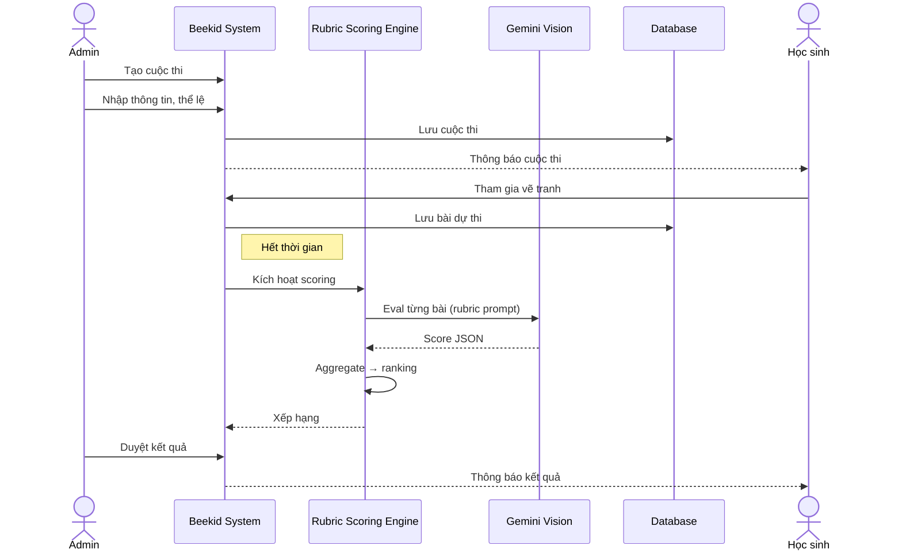

# Use Case: Tổ chức cuộc thi sáng tạo vẽ tranh

> ⚠️ **Lưu ý:** Use case này ban đầu dùng **Google DeepMind Genie 3** để đánh giá và xếp hạng bài dự thi. Genie đã bị reject vì không có scoring/ranking capability. **Thay thế bằng: Rubric Scoring Engine** — Gemini Vision đánh giá từng bài theo rubric → aggregate điểm → xếp hạng.
>
> Xem chi tiết tại [5.4.6](../proposals/proposal-beekid-ai-features.md#546-resolution--model-selection).

---

## Metadata

| Trường     | Giá trị     |
| ---------- | ----------- |
| **ID**     | UC-009      |
| **Tên**    | Drawing Competition |
| **Actor**  | Admin       |
| **Scope**  | Beekid AI Platform |
| **Status** | Draft       |

---

## 1. Brief Description

**As an** admin, **I want to** tổ chức cuộc thi vẽ tranh sáng tạo cho học sinh với đánh giá tự động bằng AI (Rubric Scoring Engine), **so that** học sinh được khuyến khích sáng tạo và có sân chơi lành mạnh, công bằng.

Cơ chế chấm điểm: Gemini Vision đánh giá từng bài theo rubric cố định (sáng tạo 0-10, kỹ thuật 0-10, phù hợp chủ đề 0-10) → Rubric Engine tổng hợp điểm → xếp hạng → admin duyệt.

---

## 2. Preconditions

- Admin đã đăng nhập
- Tính năng vẽ tranh AI đã hoạt động (UC-007, UC-008)
- Có ít nhất 1 lớp/học sinh tham gia

---

## 3. Basic Path ( Main Success Scenario )

1. Admin vào trang "Quản lý cuộc thi"
2. Admin nhấn "Tạo cuộc thi mới"
3. Admin nhập thông tin cuộc thi (tên, chủ đề, thể lệ, giải thưởng)
4. Admin chọn đối tượng tham gia (lớp, khối)
5. Admin đặt thời gian bắt đầu và kết thúc
6. Admin nhấn "Tạo cuộc thi"
7. Hệ thống tạo cuộc thi và gửi thông báo cho học sinh
8. Học sinh tham gia vẽ tranh trong thời gian cuộc thi
9. Hệ thống thu thập bài dự thi
10. Hết thời gian, hệ thống đóng cuộc thi
11. Rubric Scoring Engine đánh giá tất cả bài dự thi (Gemini Vision eval từng bài theo rubric → aggregate score → ranking)
12. Admin duyệt kết quả và công bố

---

## 4. Extensions ( Alternative Flows )

4a. **Admin gia hạn cuộc thi** (tại bước 10): Admin quyết định gia hạn thêm thời gian. Hệ thống cập nhật. Quay lại bước 8.

4b. **Admin muốn chấm thủ công** (tại bước 11): Admin không dùng Rubric Engine đánh giá mà tự chấm. Hệ thống hiển thị danh sách bài để admin chấm.

4c. **Học sinh gian lận** (tại bước 9): Hệ thống phát hiện hình vẽ copypaste hoặc nội dung không phù hợp. Admin xem xét và loại bài.

4d. **Cuộc thi có nhiều vòng** (tại bước 12): Admin tạo vòng tiếp theo với top N học sinh. Quay lại bước 8.

---

## 5. Postconditions

- Cuộc thi đã được tạo và lưu
- Bài dự thi đã được thu thập
- Kết quả đã được công bố
- Giải thưởng đã được trao (nếu có)

---

## 6. Business Rules

- BR1: Cuộc thi tối thiểu 3 ngày, tối đa 30 ngày
- BR2: Mỗi học sinh nộp tối đa 3 bài dự thi
- BR3: Bài dự thi phải phù hợp chủ đề cuộc thi
- BR4: Rubric Engine đánh giá dựa trên 3 tiêu chí: sáng tạo (0-10), kỹ thuật (0-10), phù hợp chủ đề (0-10)
- BR5: Admin có quyền override kết quả Rubric Engine

---

## 7. Special Requirements ( Optional )

- Leaderboard realtime
- Chia sẻ bài dự thi lên mạng xã hội
- Gallery hiển thị tất cả bài dự thi
- Thông báo push khi có kết quả

---

## 8. Data Requirements ( Optional )

| Data          | Source             | Notes                           |
| ------------- | ------------------ | ------------------------------- |
| Thông tin thi | Admin nhập         | Tên, chủ đề, thể lệ            |
| Đối tượng     | Admin chọn         | Lớp, khối                      |
| Thời gian     | Admin đặt          | Bắt đầu, kết thúc              |
| Bài dự thi    | Học sinh nộp       | Hình vẽ + metadata             |
| Đánh giá      | Rubric Scoring Engine | JSON: creativity, technique, relevance, total, rank |
| Kết quả       | Admin duyệt        | Final ranking                  |
