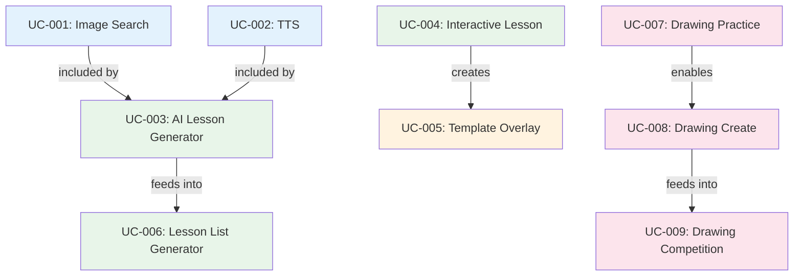

# Use Case Catalog — Beekid AI Features

> Tài liệu tổng hợp tất cả use cases của hệ thống AI features Beekid. Mỗi use case chi tiết xem tại file riêng.

---

## Hệ thống: Beekid AI Platform

### Actors

| Actor             | Mô tả                                        |
| ----------------- | --------------------------------------------- |
| **Giáo viên (GV)** | Người tạo bài giảng, quản lý nội dung       |
| **Học sinh (HS)**  | Người học tập, tương tác với bài giảng       |
| **Admin**          | Quản trị hệ thống, tổ chức cuộc thi          |

---

## Use Cases

### Module: Gemini Image Search & TTS

| ID      | Use Case           | Actor      | Brief Description                                                      | Priority | Status  | Detail                                          |
| ------- | ------------------ | ---------- | ---------------------------------------------------------------------- | -------- | ------- | ----------------------------------------------- |
| UC-001  | Gemini Image Search| Giáo viên  | As a teacher, I want to search images from Gemini so that I can use them in lessons | High | Draft | [link](./uc-001-gemini-image-search.md) |
| UC-002  | Text-to-Speech     | Giáo viên  | As a teacher, I want to convert text to audio so that students can listen | High | Draft | [link](./uc-002-text-to-speech.md) |

### Module: AI Lesson Generator

| ID      | Use Case           | Actor      | Brief Description                                                      | Priority | Status  | Detail                                          |
| ------- | ------------------ | ---------- | ---------------------------------------------------------------------- | -------- | ------- | ----------------------------------------------- |
| UC-003  | AI Lesson Generator| Giáo viên  | As a teacher, I want to create lessons from a prompt so that I save time | High | Draft | [link](./uc-003-ai-lesson-generator.md) |

### Module: Interactive Lessons (Gemini Vision)

| ID      | Use Case              | Actor      | Brief Description                                                      | Priority | Status  | Detail                                          |
| ------- | --------------------- | ---------- | ---------------------------------------------------------------------- | -------- | ------- | ----------------------------------------------- |
| UC-004  | Interactive Lesson | Giáo viên | As a teacher, I want to create interactive lessons from images using Gemini 2.5 Flash Vision so that students have interactive content | High | Draft | [link](./uc-004-interactive-lesson.md) |
| UC-005  | Template Overlay | Học sinh  | As a student, I want to interact with lesson overlays so that I learn through play | High | Draft | [link](./uc-005-template-overlay.md) |

### Module: AI Lesson List Generator

| ID      | Use Case                | Actor      | Brief Description                                                      | Priority | Status  | Detail                                          |
| ------- | ----------------------- | ---------- | ---------------------------------------------------------------------- | -------- | ------- | ----------------------------------------------- |
| UC-006  | AI Lesson List Generator| Giáo viên  | As a teacher, I want to generate lesson lists from files so that I create curriculum faster | Medium | Draft | [link](./uc-006-ai-lesson-list-generator.md) |

### Module: Drawing Game with Gemini Vision

| ID      | Use Case             | Actor      | Brief Description                                                      | Priority | Status  | Detail                                          |
| ------- | -------------------- | ---------- | ---------------------------------------------------------------------- | -------- | ------- | ----------------------------------------------- |
| UC-007  | Drawing Game Practice| Giáo viên  | As a teacher, I want to create drawing practice rooms with Gemini Vision + Rubric Pipeline so that students can draw and get AI feedback | Medium | Draft | [link](./uc-007-drawing-game-practice.md) |
| UC-008  | Drawing Game Create  | Học sinh   | As a student, I want to create drawings with AI suggestions (Gemini Vision + WebSocket) so that I can be creative | Medium | Draft | [link](./uc-008-drawing-game-create.md) |
| UC-009  | Drawing Competition  | Admin      | As an admin, I want to organize drawing competitions with Rubric Scoring Engine so that students are motivated | Low | Draft | [link](./uc-009-drawing-competition.md) |

---

## Use Case Relationships

- **included by**: Use case B luôn được thực hiện trong use case A
- **feeds into**: Output của A là input của B
- **creates**: A tạo ra B
- **enables**: A mở đường cho B

---

## Priority Legend

- **High**: Core feature, cần làm đầu tiên
- **Medium**: Quan trọng nhưng có thể làm sau
- **Low**: Nice-to-have, có thể defer

## Status Legend

- **Draft**: Chưa bắt đầu
- **In Review**: Đang review
- **Approved**: Đã approve
- **Done**: Hoàn thành

## Convention

- File chi tiết đặt trong thư mục `use-cases/`
- Tên file: `uc-XXX-ten-usecase.md`
- Sử dụng template từ `docs/use-case-template.md`
